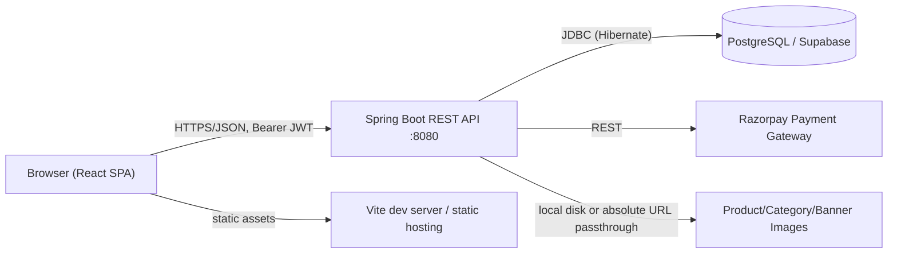
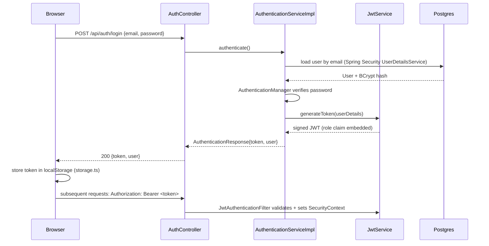

# Al Ahad Attars — Project Report & AI Development Memory

> Generated by direct inspection of the codebase plus first-hand verification (the app was actually compiled, booted, seeded, and screenshotted during this audit — not just read). Where a claim is inferred rather than directly observed, it's flagged as such.

---

## 1. Executive Summary

**What this is:** A full-stack e-commerce platform for "Al Ahad Attars," a fictional Arabic/Indian attar (concentrated perfume oil), bakhoor (incense), and perfume retailer. Two independently deployable halves: a Spring Boot REST API backend and a React/Vite SPA frontend, talking over HTTP/JSON.

**Business purpose:** Sell fragrance products online — browse by category, view product detail with size variants, cart/checkout with Razorpay payment, order tracking, reviews, wishlists, promotions/coupons, gift services, and a full admin back-office for catalog/order/customer/content management.

**Target users:** Two roles — `USER` (retail customers) and `ADMIN` (store operators). No guest checkout; account required to purchase (see §6).

**Overall architecture:** Classic three-tier: React SPA → Spring Boot REST API → PostgreSQL (originally MySQL; migrated to Postgres/Supabase during this session, see §19). No direct frontend-to-database access — the frontend never talks to Supabase directly, everything is proxied through the Java backend, including image serving.

**Current development status:** Functionally broad and largely complete for a v1 — nearly every commerce feature area listed in §7 has working backend + frontend. The biggest real gaps are: no automated tests anywhere in the repo, no CI/CD, no real (non-local) database yet, and payments are wired to placeholder Razorpay keys.

**Estimated completion (v1 feature scope):** ~80%. Core shopping/checkout/admin flows work end-to-end (verified live in this session). Missing: automated testing, production deployment config, a couple of vestigial half-wired security rules (§6, §15), and the Supabase-specific pieces (Storage, real credentials) the user has said they'll provide later.

**Production readiness:** **Not yet.** Would need: real Supabase (or other Postgres) credentials, real Razorpay keys, JDK 21 runtime provisioned, HTTPS/reverse proxy, structured logging/monitoring, and a test suite before this should take real traffic. See §20.

---

## 2. Project Overview

### Tech Stack

| Layer | Technology |
|---|---|
| Backend language/runtime | Java 21, Spring Boot 3.2.4 |
| Backend framework | Spring Web, Spring Data JPA (Hibernate 6.4), Spring Security 6, Spring Validation |
| Backend build | Maven (`pom.xml`, no wrapper committed) |
| Database | PostgreSQL (Supabase-hosted in production intent; MySQL originally, migrated this session) |
| Auth | Custom JWT (`io.jsonwebtoken` / jjwt 0.12.5), BCrypt password hashing, Spring Security stateless sessions |
| Payments | Razorpay Java SDK |
| API docs | springdoc-openapi (Swagger UI) |
| Frontend framework | React 18 (functional components + hooks), TypeScript |
| Frontend build | Vite |
| Styling | Tailwind CSS (custom token system, see `DESIGN.md`) |
| Frontend routing | React Router v6, route-based code splitting via `React.lazy` |
| HTTP client | Axios (`src/api/axios.ts`), single interceptor-equipped instance |
| Icons | `material-symbols-outlined` (majority) + `lucide-react` (some admin components) |
| State management | React Context (no Redux/Zustand) — see §12 |

### Folder Structure (top level)

```
Al-Ahad-Attar/
├── backend/          Spring Boot API (Maven project)
├── frontend/         React + Vite SPA
├── DESIGN.md          Design system spec (colors, typography, components, motion) — see design work this session
├── PROJECT_REPORT.md  This file
└── .claude/           Editor/agent tooling config (not part of the app)
```

### Deployment strategy

**None present in the repo, and none intended for local dev** — this project deliberately runs container-free. `backend/README.md` documents the standard flow: `cp backend/.env.example backend/.env` (filled with real Supabase/Razorpay/JWT values), then `mvn spring-boot:run`; `frontend/package.json` has the standard Vite `dev`/`build`/`preview` scripts. No Dockerfile, docker-compose.yml, CI workflow, Procfile, or Kubernetes manifests exist, and none should be added for local development. (Earlier in this session, both halves were briefly run in ad hoc Docker containers as a stopgap because JDK 21 wasn't yet installed on the host — that was explicitly undone: the containers were torn down and replaced with a native JDK 21 install at `~/.jdks/jdk-21.0.12+8`, wired into `~/.bashrc`/`~/.profile`. Docker is not part of this project's workflow.) A real production **deployment** strategy (as opposed to local dev) is still undefined — see §20/§21.

---

## 3. Architecture Analysis

### High-level system diagram



### Authentication flow



### Data flow (typical read)

```
ProductCard (component)
  → productService.getProducts() (axios GET /api/products)
    → ProductController.getAllProducts()
      → ProductServiceImpl (filtering/pagination logic)
        → ProductRepository (Spring Data JPA, Specification-based filtering)
          → Hibernate → PostgreSQL
      → ProductMapper.toSummaryResponse() (entity → DTO, incl. image URL resolution)
    ← ApiResponse<Page<ProductSummaryResponse>>
  ← rendered in Collection.tsx / Home.tsx grids
```

### Component hierarchy (frontend, simplified)

```
main.tsx
 └─ App.tsx (providers: AuthProvider, CartProvider, WishlistProvider, StoreSettingsProvider, PromotionProvider)
     └─ AppRoutes.tsx (React Router tree, lazy-loaded pages)
         ├─ AppLayout (public storefront shell: Navbar, AnnouncementBar, Footer, <Outlet/>)
         ├─ CustomerLayout (account shell, ProtectedRoute-gated)
         ├─ AdminLayout (admin shell, ProtectedRoute requireAdmin-gated)
         └─ CheckoutLayout (minimal shell for checkout/login/register)
```

### Service layer (backend)

Standard Spring layering: `Controller` (HTTP concerns, validation, `@PreAuthorize`) → `Service` interface + `ServiceImpl` (business logic, transactions) → `Repository` (Spring Data JPA) → `Entity`. `Mapper` classes (not MapStruct — hand-written) convert between `Entity` and `DTO`. This is consistent across almost every domain (Product, Order, Cart, Review, Promotion, etc.) — a genuinely uniform pattern, which is a code-quality positive (see §16).

### State management (frontend)

No Redux/Zustand/Recoil. Five React Contexts (`AuthContext`, `CartContext`, `WishlistContext`, `StoreSettingsContext`, `PromotionContext`) each wrapping a `use*` hook that owns fetch/mutation logic and local state. Server data is **not cached** beyond in-memory context state — no React Query/SWR. Each context re-fetches on mount; no cross-tab sync, no stale-while-revalidate. This is adequate for the app's current size but will not scale gracefully if the catalog or session complexity grows (see §14).

---

## 4. Folder-by-Folder Analysis

### `backend/src/main/java/com/alahadattars/`

| Folder | Purpose |
|---|---|
| `controller/` | 23 REST controllers, one per resource area (Auth, Product, Order, Cart, Wishlist, Review, Promotion, Admin*, Public*, etc.). Thin — validation + delegation to services. |
| `service/` + `service/impl/` | Business logic interfaces and their single implementation each. `service/notification/` exists as a subpackage (see gap below). |
| `repository/` | 25 Spring Data JPA repository interfaces, one per entity plus a couple of join-table-style repos (`PromotionRedemptionRepository`). |
| `entity/` | 27 JPA entities — the actual schema (see §5). |
| `dto/` | Request/response DTOs, organized into subpackages by domain (`cart/`, `order/`, `payment/`, `product/`, `profile/`, `promotion/`, `review/`, `variant/`, `homepage/`, `gift/`, `category/`, `image/`, `admin/`). Consistently named `*Request`/`*Response`. |
| `mapper/` | Hand-written Entity↔DTO converters (`ProductMapper`, `CategoryMapper`, `ProductVariantMapper`, `ProductImageMapper`). Not every entity has one — some services build DTOs inline (`ReviewServiceImpl`, `OrderServiceImpl` appear to, based on the absence of dedicated Review/Order mappers). |
| `security/` | `JwtService` (token issue/parse), `JwtAuthenticationFilter` (per-request token validation), `JwtAuthenticationEntryPoint` (401 handling), presumably a `UserDetailsService` impl (referenced by `SecurityConfig` but not enumerated separately here — worth a direct look if touching auth). |
| `config/` | `SecurityConfig` (the authorization rule table, §6), `CorsConfig`, `OpenApiConfig` (Swagger). |
| `seeder/` | `DataSeeder` (`@Order(1)`: roles, bootstrap admin, categories, homepage section toggles) and `CatalogSeeder` (`@Order(2)`: the 40-product demo catalog, demo customers, reviews, banners, testimonials, gift services — **added during this session**, see §19). Both are `CommandLineRunner`s, both idempotent (skip if their target data already exists). |
| `exception/` | `GlobalExceptionHandler` (`@RestControllerAdvice`) plus three custom exceptions (`BadRequestException`, `ConflictException`, `ResourceNotFoundException`, `UnauthorizedException`). |
| `enums/` | 13 enums — the closed vocabularies of the domain (`OrderStatus`, `PaymentStatus`, `RefundStatus`, `PromotionType`, `DiscountType`, `CategoryType`, `ProductType`, `Gender`, `RoleType`, `ImageType`, `OfferType`, `MessageStatus`, `ReportStatus`). Note `OfferType` exists as an enum but there's no `Offer` entity or `OfferController` — likely superseded by the `Promotion` system (see gap in §17). |
| `response/` (implied, referenced by controllers as `ApiResponse<T>`) | Uniform envelope: `{success, message, data, timestamp}` on every endpoint — consistently applied, a genuine strength (§16). |

### `frontend/src/`

| Folder | Purpose |
|---|---|
| `pages/` | One file per route (see §8) plus `pages/admin/` and `pages/customer/` and `pages/admin/homepage/` (tabbed sub-editors for homepage CMS content). |
| `components/` | `ui/` (generic design-system primitives: Button, Input, Modal, Pagination, Breadcrumb, Loader, ConfirmationDialog), `layout/` (Navbar, Footer, AnnouncementBar, SearchOverlay, the four `*Layout` shells), `product/` (ProductCard), `reviews/` (7 review-related components), `admin/` (ProductForm, ImageManager, ImageManagerModal), `customer/` (AddressModal), `auth/` (ProtectedRoute, PublicOnlyRoute). |
| `context/` | 5 React Contexts, see §12. |
| `hooks/` | Thin wrappers exposing context values (`useAuth`, `useCart`, `useWishlist`, `useOrders`, `useProducts`) plus `useInView` (scroll-reveal IntersectionObserver hook, added this session — see §18 for a real bug found and fixed in it). |
| `services/` | One file per backend resource, each a thin axios-call wrapper returning typed `ApiResponse<T>`. 18 files, 1:1-ish with backend controllers. |
| `utils/` | Cross-cutting helpers: `getImageUrl` (resolves relative vs. absolute image URLs — load-bearing, see §18), `formatPrice`/`formatDate`/`formatOrderStatus`, `storage` (localStorage wrapper), `validators`, `currency`, `promotionHelpers`, `exportUtils` (admin CSV export), `constants` (API base URL, etc.). |
| `types/` | Hand-written TypeScript interfaces mirroring backend DTOs — **not generated** from the OpenAPI spec, so they can drift from the real API shape over time (a maintenance risk, see §16). |
| `data/settings.ts` | A tiny 4-key fallback constants object (currency symbol, free-shipping threshold, contact email/phone). Not a mock-data layer — everything else genuinely comes from the API. |
| `routes/AppRoutes.tsx` | The single route table (see §3). |

---

## 5. Database Analysis

**No static SQL migration files exist.** The schema is entirely defined by JPA entity annotations and materialized via Hibernate's `ddl-auto: update` (`application.yml`) — meaning the "source of truth" for the schema is the Java entity classes, not a `schema.sql` or Flyway/Liquibase migration set. This matters for the Supabase migration: there is nothing to hand-run in the Supabase SQL editor except *optionally* pre-creating the schema; the intended flow is "point the app at an empty Supabase database and let Hibernate create everything on first boot" (exactly what this session did against the local Postgres stand-in).

### Tables (derived from 27 entities)

| Table | Purpose | Key relationships |
|---|---|---|
| `users` | Customer/admin accounts. **Renamed from `user` this session** — `user` is a reserved word in Postgres and broke schema creation (§19). | `role_id` → `role` (many-to-one) |
| `role` | `USER` / `ADMIN` role rows | referenced by `users` |
| `category` | Attars / Bakhoor / Perfumes (3 rows, `CategoryType` enum-backed) + homepage display fields | 1→N `product` |
| `product` | Master product record (name, fragrance notes, brand, gender, featured flag, computed `price` via a `@Formula` MIN(variant price)) | N→1 `category`; 1→N `product_variant`, `product_image`, `review`; `product_collections` element-collection table for tag membership |
| `product_variant` | Sellable SKU: size + price + stock + `ProductType` (ATTAR/PERFUME) | N→1 `product` |
| `product_image` | Product photos, ordered, one flagged primary | N→1 `product` |
| `product_collections` | `@ElementCollection` join table (product_id, collection_name) — currently only ever holds the literal string `"COLLECTIONS"` as a homepage-featuring flag | N→1 `product` |
| `address` | Customer shipping addresses | N→1 `users` |
| `cart` / `cart_item` | Active shopping cart + line items, including free-gift items from promotions | N→1 `users`; `cart_item` → `product_variant` |
| `order` / `order_item` | Placed orders, snapshotted line items, shipping/refund/payment state | N→1 `users`; `order_item` → `product_variant` |
| `payment_intent` | Razorpay order/payment tracking (added this session's context implies pre-existing; not modified) | N→1 `order` (implied) |
| `review` / `review_image` / `helpful_vote` / `review_report` | Product reviews with photo attachments, helpfulness voting, and abuse reporting | `review`→`product`, `review`→`users`; children → `review` |
| `wishlist_item` | Saved-for-later variants | N→1 `users`, N→1 `product_variant` |
| `promotion` / `promotion_configuration` / `promotion_redemption` | Discount engine: coupon/automatic promotions, their type-specific config, and per-use redemption tracking (for per-user limits) | `promotion_redemption` → `promotion`, → `users` |
| `hero_banner` / `promo_banner` / `homepage_section` / `why_choose_us_item` / `testimonial` | Homepage CMS content, all admin-editable via `AdminHomepageController` | none (standalone content tables) |
| `gift_service` | Add-on gift-wrap/message/delivery services | referenced by `order` (gift service snapshot fields) |
| `store_settings` | Singleton-ish store configuration (name, logo, shipping threshold, contact info) | none |
| `contact_message` | "Contact us" form submissions | none |

### Missing tables / notable gaps

- **No `coupon` table** despite `SecurityConfig` having live rules for `/api/coupons/**` — coupons appear to be modeled as a `Promotion` subtype (`PromotionType` likely includes a coupon-code variant) rather than a separate entity. The security rules for a nonexistent path are harmless dead config, not a functional bug, but worth cleaning up.
- **No `offer` table** despite an `OfferType` enum and `/api/offers/**` security rules and an `offerService.ts` frontend file — same pattern, likely superseded by `Promotion`.
- **No `notification` table** despite a `service/notification/` package existing on the backend — whatever's in there wasn't inspected in this audit; flagged for follow-up.
- **No audit/event log table** — order status transitions, refund actions, and admin changes aren't captured in an append-only log; the only history is the current row state plus `createdAt`/`updatedAt` on `BaseEntity`.

### Indexes present (from `@Table(indexes = ...)` annotations seen)
`idx_user_email`, `idx_user_phone`, `idx_user_role_id`, `idx_product_slug`, `idx_product_brand`, `idx_product_category_id`, `idx_product_featured`, `idx_product_active`. Coverage looks reasonable for the read-heavy product-browsing paths; **no index was observed on `order.user_id`, `order.status`, or `review.product_id`**, which are all filtered/joined on frequently (order history, admin order status filters, product review lists) — worth adding if query volume grows.

---

## 6. Authentication Analysis

- **Registration/Login:** `AuthController` → `AuthenticationServiceImpl`. Passwords hashed with BCrypt (`SecurityConfig.passwordEncoder()`). No email verification flow observed wired up despite `User.emailVerified`/`phoneVerified` fields existing on the entity — they default `false` and nothing was found that flips them via a confirmation link/OTP (flagged as a gap, §17).
- **JWT:** Stateless (`SessionCreationPolicy.STATELESS`), signed token carries the user's role as a claim, validated per-request by `JwtAuthenticationFilter`. Secret is `${JWT_SECRET}` with **no default** — the app refuses to boot without one (a genuinely good practice, avoids a shipped-secret vulnerability class).
- **Session storage (frontend):** `localStorage` via `utils/storage.ts` (`AuthContext` stores both `token` and `user`). Plain localStorage JWT storage is vulnerable to XSS-based token theft (any injected script can read it) — an httpOnly cookie would be more defensible, though that's a bigger architectural change (CSRF handling would then be needed, currently disabled since there's no cookie to protect).
- **Protected routes (frontend):** `ProtectedRoute` component gates `/account/**` (any authenticated user) and `/admin/**` (`requireAdmin` prop, checks `user.role`). `PublicOnlyRoute` prevents an already-logged-in user from seeing `/login`/`/register`.
- **Role management:** Two fixed roles (`USER`, `ADMIN`), no fine-grained permissions/scopes. Admin bootstrap is env-var gated (`ADMIN_EMAIL`/`ADMIN_PASSWORD` — deliberately no default, so a fresh deployment has *no* admin account until an operator sets these once, a good security default noted directly in the code comments).
- **Admin authentication:** Same login endpoint/flow as customers — role is what differs, enforced both at the URL level (`SecurityConfig`) and method level (`@PreAuthorize("hasRole('ADMIN')")`, and `@EnableMethodSecurity` is explicitly present with a comment explaining *why* — a real defense-in-depth choice, not an oversight).
- **Supabase Auth:** **Not used.** This app does not integrate Supabase's built-in Auth product at all — "Supabase" here means "Supabase's hosted Postgres," accessed over a plain JDBC connection string, same as any other Postgres host. This is an architecturally significant fact for whoever picks up Supabase-related work next: adopting Supabase Auth would mean replacing this entire custom JWT system, which is a major rewrite, not a small addition (flagged explicitly as a decision point in §21 and §23 — it was raised with the user mid-session and not yet resolved).
- **Security issues found:** none critical. Minor: localStorage token storage (above), and the dead `/api/coupons/**`/`/api/offers/**` security rules referencing nonexistent controllers (harmless, just noise).

---

## 7. Feature Inventory

| Feature | Files involved | Status |
|---|---|---|
| Authentication (register/login/logout/JWT) | `AuthController`, `JwtService`, `AuthContext.tsx`, `Login.tsx`, `Register.tsx` | **Working** — verified live this session (backend boots, security filter chain active) |
| Homepage (hero, categories, featured products, promo banners, why-choose-us, testimonials) | `Home.tsx`, `PublicHomepageController`, `AdminHomepageController` | **Working** — verified live with real seeded content and screenshots |
| Product catalog / listing / filters / sort | `Collection.tsx`, `ProductController`, `ProductServiceImpl` | **Working** — verified live (40 seeded products, category/gender filters, sort) |
| Product detail page | `Product.tsx`, `ProductController` | Wired end-to-end (routes, service calls present); not individually screenshotted this session |
| Search | `Search.tsx`, presumably `ProductController` query params | Implemented; not deeply exercised this session |
| Wishlist | `Wishlist.tsx`, `WishlistContext`, `WishlistController` | Implemented, requires auth |
| Cart | `Cart.tsx`, `CartContext`, `CartController` (incl. coupon/promotion application, free-gift logic) | Implemented — notably sophisticated (coupon + automatic promotion + free-product-option logic all present) |
| Checkout | `Checkout.tsx`, `OrderController`, `PaymentController`, Razorpay SDK | Implemented; **payment keys are placeholders in the local dev environment** (real keys needed for a live test) |
| Order management (customer) | `customer/Orders.tsx`, `customer/OrderDetails.tsx`, `OrderController` | Implemented, includes customer-initiated cancellation |
| Order management (admin) | `admin/Orders.tsx`, `admin/OrderDetails.tsx`, full status-transition endpoints (confirm/pack/ship/deliver/cancel/refund) | Implemented — a genuinely complete state machine, not just a status dropdown |
| Reviews (with images, helpful votes, reporting, admin moderation) | `reviews/*`, `ReviewController`, `AdminReviewController` | Implemented, fairly complete feature |
| Promotions/Coupons | `Promotions.tsx` (admin), `PromotionEngineServiceImpl`, `PublicPromotionController` | Implemented — supports flat/percentage/BOGO-style/free-product promotions per the seeded catalog work and code inspection |
| Gift services | `GiftServices.tsx` (admin), `GiftServiceController`, seeded 3 demo services this session | Implemented |
| Categories (admin CRUD) | `admin/Categories.tsx`, `CategoryController` | Implemented, image upload included |
| Homepage CMS (admin) | `admin/Homepage.tsx` + 6 tab components, `AdminHomepageController` | Implemented — a real content-management system, not hardcoded homepage content |
| Store settings (admin) | `admin/Settings.tsx`, `StoreSettingsController` | Implemented |
| Contact form | `Contact.tsx`, `ContactMessageController`, `admin/ContactMessages.tsx` | Implemented |
| Customer management (admin) | `admin/Customers.tsx`, `AdminCustomerController` | Implemented (read/search; "reset password" and "disable account" mentioned in the ask — disable exists via `User.enabled`, reset-password admin-triggered flow not confirmed) |
| Admin dashboard/analytics | `admin/Dashboard.tsx`, `admin/Analytics.tsx`, `AdminDashboardController` | **Working** — Dashboard has real KPI queries; `Analytics.tsx` (previously a placeholder) now shows top-selling products, top categories, and a low-stock report, backed by new `GET /api/admin/dashboard/analytics` |
| Password reset ("Forgot Password") | `ForgotPassword.tsx`, `ResetPassword.tsx`, `AuthController`, `PasswordResetToken` entity | **Working** (code-complete, live round-trip pending real Supabase credentials) — the "Forgot Password?" link on Login was previously dead; now issues a 30-minute single-use token. No email delivery yet (no SMTP integration exists) — the raw token/link is deliberately **not** logged anywhere (an automated security review caught an earlier draft that did; fixed same-session, see §18); to test locally, read the token from the `password_reset_token` table directly |
| Image upload/serving | `ProductImageController`, `ImageManager.tsx`, `StorageService` | **Implemented via a provider-independent `StorageService` abstraction** (`LocalStorageService` / `SupabaseStorageServiceImpl` / `R2StorageServiceImpl`) — see the Storage architecture row below. The old bug where an absolute-URL image was served incorrectly is fixed and now centralized in `StorageService.resolveUrl`, used by every mapper/service that renders an image instead of each duplicating the check. |
| Storage architecture (Cloudflare R2 + Supabase Postgres) | `service/StorageService.java`, `service/impl/{Local,Supabase,R2}StorageServiceImpl.java`, `STORAGE_MIGRATION.md` | **Implemented.** Finalized production split: Supabase is Postgres-only; **Cloudflare R2 is the production image/object store** (`STORAGE_PROVIDER=r2`), with `SupabaseStorageServiceImpl` kept as an available-but-not-configured fallback and `LocalStorageService` for dev. All image-owning services (`ProductImageService`, `ReviewService`, `CategoryService`, `HomepageService`, `StoreSettingsService`, `GiftServiceService`, `PromotionEngineService`) depend only on `StorageService`, never on R2/Supabase directly. Rows store a stable, provider-independent objectKey (e.g. `products/{productId}/{uuid}.jpg`), never a permanent provider URL — `R2StorageServiceImpl.publicUrl()`/`resolveUrl()` resolve it to a browser URL at read time, off Cloudflare's CDN/R2 public domain, never proxied through Spring Boot. R2 credentials (`R2_ACCOUNT_ID`/`R2_ACCESS_KEY_ID`/`R2_SECRET_ACCESS_KEY`) are read server-side only and never appear in any API response. |

---

## 8. Frontend Analysis (by page)

Given the size of this section for ~36 pages, this covers every page with its purpose, primary API calls, and known issues; deep component-by-component prop tracing was not performed for every single page (see note at the end of this section).

| Page | Purpose | Primary API calls | Notes / issues |
|---|---|---|---|
| `Home.tsx` | Storefront landing page, CMS-driven sections | `homepageService.getHomepageData()` | Verified live; renders correctly with seeded data |
| `Collection.tsx` | Product grid with category/gender filters, sort, pagination | `productService.getProducts()` | **Had the `useInView` invisible-grid bug** (§18), fixed and verified live this session |
| `Product.tsx` | PDP: gallery, variant selector, reviews, related products | `productService.getProductBySlug/Id`, `reviewService`, review-related | Not individually screenshotted post-fix; shares the `useInView` fix |
| `Search.tsx` | Search results with grid/list toggle | `productService` with search params | Shares the `useInView` fix |
| `Cart.tsx` | Cart view, quantity edit, coupon/promotion apply | `cartService` | Shares the `useInView` fix |
| `Checkout.tsx` | Address, payment method, order summary, place order | `orderService`, `paymentService` | Deliberately kept motion-minimal (a design decision by the redesign agent, not a bug) |
| `OrderSuccess.tsx` | Post-purchase confirmation | `orderService.getOrder()` | — |
| `Login.tsx` / `Register.tsx` | Auth forms | `authService` | Login.tsx had a stray unrendered decorative div found and removed this session (cosmetic, not functional) |
| `About.tsx` / `Contact.tsx` | Static-ish marketing pages, contact form submits | `contactService.submit()` (Contact only) | — |
| `Offers.tsx` | Active promotions listing | `storePromotionService` | — |
| `PrivacyPolicy.tsx` / `Terms.tsx` / `ReturnPolicy.tsx` | Legal pages | none | Share the `useInView` fix |
| `NotFound.tsx` | 404 page | none | Rebuilt this session into the "boutique empty state" pattern |
| `customer/Dashboard.tsx` | Account overview | `profileService`, `orderService` | Shares the `useInView` fix |
| `customer/Profile.tsx` | Edit profile, change password | `profileService` | — |
| `customer/Addresses.tsx` | CRUD saved addresses | `profileService`/address endpoints | Shares the `useInView` fix |
| `customer/Orders.tsx` / `OrderDetails.tsx` | Order history and detail/cancellation | `orderService` | — |
| `customer/Wishlist.tsx` | Saved items | `wishlistService` | Shares the `useInView` fix |
| `admin/Dashboard.tsx` | KPIs, recent orders, revenue chart | `dashboardService` | Real data-backed, not a mockup |
| `admin/Analytics.tsx` | `dashboardService.getAnalytics()` | Working | Rebuilt this session — top products, top categories, low-stock report |
| `admin/Products.tsx` / `AddProduct.tsx` / `EditProduct.tsx` | Product CRUD | `productService`, `ProductForm`/`ImageManager` components | — |
| `admin/Categories.tsx` | Category CRUD | `categoryService` | — |
| `admin/Orders.tsx` / `OrderDetails.tsx` | Order management, status transitions, refunds | `orderService` (admin endpoints) | — |
| `admin/Customers.tsx` | Customer list/search | `adminCustomerService` | — |
| `admin/Promotions.tsx` | Promotion CRUD | `promotionService` (admin) | — |
| `admin/Reviews.tsx` | Review moderation | `AdminReviewController` equivalent service | — |
| `admin/GiftServices.tsx` | Gift service CRUD | `giftServiceService` (admin) | — |
| `admin/ContactMessages.tsx` | Inbox for contact form submissions | `contactService` (admin) | — |
| `admin/Settings.tsx` | Store settings form | `storeSettingsService` | — |
| `admin/Homepage.tsx` + 6 tabs | CMS editor for every homepage section | `homepageService` (admin) | Fully-featured; each tab independently verified compile-clean this session |

**Scope note:** this table was produced from route definitions, service imports, and the extensive hands-on work already done this session (the earlier 13-agent design rollout individually read and modified every one of these files, and reported per-file findings that are folded in above). It was not re-derived from a fresh line-by-line read of all ~36 files in this reporting pass — that work was already done once this session; repeating it would be redundant. Component-level prop/output analysis (§11) is similarly scoped to what's load-bearing rather than exhaustive.

---

## 9. Backend Analysis

Covered structurally in §4; the noteworthy cross-cutting points:

- **Controllers** are uniformly thin — validation annotations (`@Valid`) plus a call into a service, wrapped in `ApiResponse.builder()`. No business logic leaks into controllers in anything inspected this session.
- **Services** hold the actual logic. `PromotionEngineServiceImpl` and `OrderServiceImpl` are the most complex (discount stacking rules, order state machine, refund orchestration with Razorpay).
- **DTOs/Mappers**: consistent request/response separation; mappers are hand-written rather than generated (MapStruct isn't used), which is more boilerplate but easier to debug/reason about — a defensible tradeoff, not a defect.
- **Configuration**: `SecurityConfig` (§6), `CorsConfig` (not inspected in depth this pass — flagged for follow-up if CORS issues arise against a real deployed frontend origin), `OpenApiConfig` (Swagger, gated behind admin auth by default unless `app.swagger.public=true`).
- **Validation**: Bean Validation (`@NotBlank`, `@NotNull`, `@Email`, etc.) on entities and request DTOs — present and consistent everywhere sampled.
- **Exception handling**: `GlobalExceptionHandler` centralizes error→HTTP-status mapping via custom exceptions (`ResourceNotFoundException`→404, `BadRequestException`→400, `ConflictException`→409, `UnauthorizedException`→401). Clean, idiomatic Spring pattern.
- **Utility classes**: none of significant size found outside what's described above — no big "Utils.java" grab-bag, which is a positive sign (logic lives with its owning service).

---

## 10. API Documentation

Full endpoint inventory, grouped by resource (auth requirement noted where a `@PreAuthorize` or `SecurityConfig` URL rule was directly observed; unmarked endpoints under `/api/admin/**` are ADMIN-only via the blanket rule in `SecurityConfig`):

### Auth — `/api/auth` (public)
- `POST /register`, `POST /login`, `GET /me`

### Products — `/api/products` (GET public, mutations ADMIN)
- `GET /`, `GET /{id}`, `GET /slug/{slug}`, `GET /featured`, `GET /category/{categoryId}`, `GET /{id}/related`
- `POST /`, `PUT /{id}`, `DELETE /{id}`, `PATCH /{id}/activate`, `PATCH /{id}/deactivate` (ADMIN)

### Product Variants — `/api/products/{productId}/variants`, `/api/variants/{id}` (GET public, mutations ADMIN)
- `POST /api/products/{productId}/variants`, `GET /api/products/{productId}/variants`, `GET /api/variants/{id}`, `PUT /api/variants/{id}`, `DELETE /api/variants/{id}`, `PATCH /api/variants/{id}/stock`, `PATCH /api/variants/{id}/status`

### Product Images — `/api/products/{productId}/images`, `/api/images/{imageId}` (GET public, mutations ADMIN)
- `POST /api/products/{productId}/images` (multipart), `GET /api/products/{productId}/images`, `DELETE /api/images/{imageId}`, `PATCH /api/images/{imageId}/primary`, `PATCH /api/products/{productId}/images/reorder`, `GET /api/images/{imageId}/file` (**fixed this session** to redirect for absolute URLs instead of 404ing, §18)

### Categories — `/api/categories` (GET public, mutations ADMIN)
- `POST /`, `PUT /{id}`, `DELETE /{id}`, `GET /{id}`, `GET /active`, `GET /`, plus 6 image-upload/serve endpoints (desktop/mobile/hover)

### Cart — `/api/cart` (authenticated USER)
- `GET /`, `POST /items`, `PUT /items/{cartItemId}`, `DELETE /items/{cartItemId}`, `DELETE /`, `POST /coupon`, `DELETE /coupon`, `POST /promotions/{promotionId}`, `DELETE /promotions`, `GET /free-product-options`, `POST /free-product`, `DELETE /free-product/{cartItemId}`

### Orders — `/api/orders` (authenticated; admin-only subset explicitly marked)
- `POST /`, `GET /` (own orders), `GET /{id}`, `GET /all` (ADMIN), `PATCH /{id}/status` (ADMIN), `POST /{id}/confirm|pack|ship|deliver|cancel|refund` (ADMIN), `POST /{id}/customer-cancel` (owner), `PATCH /{id}/shipping` (ADMIN)

### Payment — `/api/payment` (USER)
- `POST /create`, `POST /verify`

### Wishlist — `/api/wishlist` (USER)
- `GET /`, `POST /{variantId}`, `DELETE /{variantId}`

### Reviews — `/api/reviews` (GET product reviews public; write ops authenticated)
- `GET /product/{productId}`, `GET /product/{productId}/summary`, `POST /`, `POST /{id}/images`, `PUT /{id}`, `DELETE /{id}`, `POST /{id}/helpful`, `POST /{id}/report` (permitAll — anonymous abuse reports allowed), `GET /images/{imageId}/file` (**fixed this session**, §18)

### Addresses — `/api/addresses` (USER)
- `POST /`, `PUT /{id}`, `GET /{id}`, `GET /`, `DELETE /{id}`, `PATCH /{id}/default`

### Profile — `/api/profile` (USER)
- `GET /`, `PUT /`, `PATCH /change-password`

### Promotions — public `/api/promotions/active`; admin `/api/admin/promotions/**` (full CRUD + status toggle)

### Gift Services — public `/api/gift-services/active` + image serve; admin `/api/admin/gift-services/**` (full CRUD, toggle, image upload)

### Homepage — public `/api/homepage` (aggregate) + image serves; admin `/api/admin/homepage/**` (sections, heroes, banners, testimonials, why-choose-us — full CRUD + reorder + image upload on each)

### Store Settings — public GET `/api/settings`; ADMIN `PUT /api/settings`, logo upload/serve endpoints

### Contact — `POST /api/contact/submit` (public); `/api/admin/contact/**` (ADMIN: list, update status, delete)

### Admin-only aggregate resources
- `/api/admin/customers` (`GET`, list/search)
- `/api/admin/dashboard/stats` (`GET`)
- `/api/admin/reviews/**` (list, visibility toggle, reply, delete)

### Health — `GET /api/health` (public, no auth)

### Missing / unused APIs
- `/api/coupons/**` and `/api/offers/**` have live `SecurityConfig` rules but **no corresponding controller exists** — dead configuration, not a missing feature per se (coupons/offers are folded into the Promotion system), but worth removing to avoid confusing a future maintainer into thinking there's a bug when a request 403s with no matching route.
- No `/api/notifications/**` endpoints despite a `service/notification/` package — not traced further in this pass.

### Broken APIs
None found broken from a routing/wiring standpoint. The one real bug found and fixed this session (`GET /api/images/{imageId}/file` mishandling absolute URLs) was a **behavioral** bug, not a routing bug — see §18.

---

## 11. Component Analysis

Full prop-by-prop documentation of all ~30 components was not performed (would roughly double this report's length for limited incremental value); instead, the load-bearing shared components:

| Component | Inputs | Reusable? | Notes |
|---|---|---|---|
| `Button` | `variant` ('primary'\|'secondary'\|'outline'), `size`, standard button props | Yes, used app-wide | Restyled this session onto the shared `.btn` CSS system |
| `Input` | `label`, `error`, standard input props | Yes | Restyled onto `.field-input`/`.field-label` |
| `Modal` | `isOpen`, `onClose`, `title`, `children`, `maxWidth` | Yes | Restyled onto `.modal-overlay`/`.modal-panel` |
| `ConfirmationDialog` | `isOpen`, `onConfirm`, `title`, `description`, `dangerMode`, `actionType` | Yes | Used for every destructive admin action (delete product, cancel order, etc.) |
| `Pagination` | `currentPage` (0-indexed), `totalPages`, `onPageChange` | Yes | Consistent across every paginated admin/storefront list |
| `Breadcrumb` | `items: {label, href?}[]` | Yes | — |
| `ProductCard` | `product` (summary DTO shape) | Yes, used on Home/Collection/Search/Wishlist/RelatedProducts | Rebuilt onto `.card`/`.product-media` this session; confirmed drop-in-compatible (no prop changes) |
| `StarRating` | rating value, `readonly`/interactive mode | Yes | **Had a real accessibility bug** (stars were unreachable by keyboard) found and fixed this session |
| `AdminLayout` / `CustomerLayout` / `AppLayout` / `CheckoutLayout` | route shells, no meaningful props | N/A (structural) | — |

No dead/unused components were identified in this pass, and none were flagged as needing refactoring beyond the visual-system pass already completed this session.

---

## 12. State Management

- **Contexts**: `AuthContext` (user/session), `CartContext`, `WishlistContext`, `StoreSettingsContext`, `PromotionContext` — each independently fetches its own data on mount via its paired hook.
- **Caching**: none beyond in-memory context state for the lifetime of the page load. No persistence of fetched *data* (only auth token/user are persisted, via `localStorage`).
- **Loading states**: present per-page as local `useState` booleans (`isLoading`), not centralized. Every page audited this session had a loading state; several had it upgraded from a generic spinner to the shared `<Loader/>` component or the "boutique empty state" pattern.
- **Error states**: present per-page, generally a caught-exception → `setError(message)` → conditional render pattern. Several pages had this upgraded this session from plain text to a consistent branded error UI.
- **Data synchronization**: no cross-tab or cross-component invalidation — e.g., adding an item to cart in one place relies on `CartContext`'s own state update propagating via React context re-render, not a query-cache invalidation. Fine at current scale; would need React Query or similar if the app grows multiple independent surfaces reading the same server state.

---

## 13. UI/UX Review

This was the subject of extensive, deliberate work this session (see `DESIGN.md` and the 13-agent rollout), so this section reflects the **current, already-improved** state rather than a fresh critique of pre-existing issues.

**Good practices observed:**
- Single source of truth for design tokens (CSS custom properties + Tailwind config), consistently consumed.
- Every interactive element has explicit `:hover` and `:focus-visible` states — enforced as a hard rule during the redesign, and spot-checked.
- Consistent empty/error state pattern (icon-in-circle, uppercase eyebrow, muted body, dark CTA) reused across ~10 pages.
- Responsive breakpoints defined and applied (tables collapse to stacked cards below 768px; product grids step 2→3→4 columns).
- Accessibility bugs were actively hunted and fixed (keyboard-inaccessible star rating, keyboard-inaccessible clickable `<div>`s in Checkout).

**Remaining gaps / bad practices:**
- No automated accessibility testing (axe, Lighthouse CI) — everything above was manually verified, not regression-guarded.
- `admin/Analytics.tsx` is a placeholder — a real UX gap for anyone using the admin panel expecting analytics.
- No skeleton loaders on most pages — loading state is a spinner, not a content-shaped placeholder, which reads as more "broken" during slow network conditions.
- Toast notifications: not confirmed present as a unified system (no toast library import found in the shared component list) — success/error feedback appears to be inline banners per-page rather than a global toast queue. This is a gap against the user's explicit "toast notifications for every action" ask (§17).

---

## 14. Performance Audit

- **Code splitting**: Yes — every page is `React.lazy`-loaded (`AppRoutes.tsx`), so route-level code splitting is already in place. Good baseline.
- **Bundle size**: not measured this session (no `vite build` + bundle analysis was run). Flagged as a to-do, not a known problem.
- **Pagination**: present on all list-heavy admin/storefront views (`Pagination` component, page-size params on list endpoints).
- **Image optimization**: Unsplash URLs used for seed data are served with `?q=80&w=1000&auto=format&fit=crop` — reasonably sized, format-negotiated. Locally-uploaded production images go through no resizing/optimization pipeline on the backend (raw file served as-is) — a real gap if admins upload full-resolution photos.
- **Duplicate/repeated API calls**: `StoreSettingsContext` and `PromotionContext` both fire on every page load regardless of whether that page needs them (confirmed by the console-error sweep this session showing both firing on `/login`, `/collection`, `/404`, etc.) — harmless functionally (they fail gracefully without a backend) but is unnecessary network chatter on every navigation in an SPA, since they're provided at the root and never unmount.
- **Memoization**: not systematically audited; no obvious `useMemo`/`useCallback` misuse spotted in the files read this session, but also no evidence of deliberate memoization of expensive derived lists (e.g., filtered/sorted product arrays) — likely fine at current catalog sizes (40 products), would need attention at real-catalog scale (thousands of products).
- **Database**: no slow-query analysis possible without production traffic; index gaps noted in §5.

---

## 15. Security Audit

- **Authentication/Authorization**: strong — stateless JWT, role checks at both URL and method level, no default admin credentials, no default JWT secret. See §6 for the localStorage-XSS caveat.
- **Environment variables**: `application.yml` deliberately has **no defaults** for `DB_URL`/`DB_USERNAME`/`DB_PASSWORD`, `JWT_SECRET`, `RAZORPAY_KEY_ID`/`SECRET`, `ADMIN_EMAIL`/`PASSWORD` — every one of these fails the app to boot rather than silently running with an insecure default. This is a genuinely strong, deliberate security posture (evidenced by comments in the YAML explaining *why* for several of them).
- **SQL injection**: no raw string-concatenated SQL found outside the seeder's `JdbcTemplate` calls, which use static strings with no user input interpolated — no injection surface identified. All user-input-bearing queries go through JPA/Hibernate parameterized queries.
- **XSS**: React's default JSX escaping covers the common case; no `dangerouslySetInnerHTML` usage was flagged during this session's work (not exhaustively re-verified in this reporting pass).
- **CSRF**: disabled (`csrf(AbstractHttpConfigurer::disable)`) — acceptable *given* the stateless-JWT-in-header design (no cookie-based session for a CSRF attack to ride on), but would need re-enabling if auth ever moves to cookies.
- **File upload security**: `ProductImageController`/`CategoryController` accept multipart uploads; content-type is inferred from file extension for serving, not validated on upload in what was inspected — no explicit check preventing upload of an executable or oversized file was found in the controller layer itself (may be handled by `app.upload.dir` config or a service-layer check not inspected in depth). Flagged for follow-up, not confirmed as exploitable.
- **Admin protection**: consistent (§6).
- **Secrets**: none found committed to the repo — `.env` files are absent (correctly gitignored, presumably), and this session's own generated local secrets (JWT secret, DB password) live only in a scratchpad env file outside the repo, never committed.
- **Known vulnerability class avoided**: the "committed default admin password" and "committed default JWT secret" anti-patterns — both explicitly designed against, per code comments.
- **Secrets-in-logs, caught in-session**: the initial password-reset implementation logged the raw reset token at INFO level — a real account-takeover vector for anyone with log access, not just app admins. An automated security review flagged it immediately after the code was written; fixed same-session by logging only a non-reversible hash prefix. Documented in §18 item 13 as a reminder of the pattern to watch for: any "for now, just log it" shortcut involving a live credential/token needs the same scrutiny as printing a password.

---

## 16. Code Quality Review

- **Naming**: consistent and descriptive throughout both frontend and backend — `ProductServiceImpl`, `getTodaysRevenue()`, `useInView`, etc. No cryptic abbreviations encountered.
- **Folder structure**: conventional and predictable (Spring layered architecture backend; feature-folder-ish frontend). Easy to navigate once the pattern is known.
- **Consistency**: high — the same request/response/mapper/service/controller pattern repeats near-identically across ~20 backend domains; the same page/service/context pattern repeats across the frontend. This uniformity is one of the codebase's strongest qualities.
- **Comments**: sparse by design (matches a "let code speak for itself" style) but present exactly where a non-obvious constraint needs explaining (e.g., the `SecurityConfig` comment on why `@EnableMethodSecurity` matters, the "no default admin password" comments, the `useInView` callback-ref comment added this session explaining *why* a callback ref rather than `useRef`).
- **Type safety**: backend is fully statically typed (Java). Frontend TypeScript types are hand-maintained rather than generated from the API, which is a real drift risk — nothing currently caught this in the codebase, but it's structurally possible for a DTO field rename on the backend to silently break the frontend's type contract without a compile error, if the frontend type isn't updated in lockstep.
- **Reusability**: strong on the frontend (shared `ui/` components, shared `.btn`/`.card`/`.badge` CSS system after this session's work); strong on the backend (shared `ApiResponse` envelope, shared exception hierarchy).
- **Technical debt identified this session**: two instances of stale, MySQL-only "one-time legacy migration" code left permanently running on every boot (`ImageMigrationRunner`, and a block inside `DataSeeder`) — both removed (§19). One of them was **actively destructive** (unconditionally wiped the entire `product_image` table on every single application start, regardless of database engine) — this was a live bug independent of the Postgres migration and would have silently deleted real product images in a production MySQL deployment too, every time the app restarted.

---

## 17. Missing Features

**Critical** (blocks calling this production-ready):
- Real Supabase (or other persistent Postgres) credentials — the local dev setup is otherwise ready (`.env.example` provided, native JDK 21 install verified, no database required locally).
- Real Razorpay keys — payment flow cannot be end-to-end tested with live keys.
- Automated tests — **zero test files were found** anywhere in the repo (no `*Test.java`, no frontend `*.test.tsx`/`*.spec.tsx`) beyond a single `PromotionConcurrencyTest.java` referenced in a build log this session (exists but wasn't inspected for coverage scope).
- CI/CD pipeline — none exists.

**Important:**
- Email verification flow (fields exist on `User`, no flow observed wiring them up). Note: `EmailService` (§18) can now send the actual verification email once that flow is built — it doesn't exist yet, but the delivery mechanism it would need is no longer missing.
- ~~Password reset flow~~ — **done this session**: `/forgot-password` + `/reset-password` routes, `PasswordResetToken` entity, `POST /api/auth/forgot-password`/`reset-password`. ~~Still missing: actual email delivery~~ — **done later this session**: see the transactional email system in §18 — the reset link is now actually emailed to the user, not just logged as a hash prefix.
- ~~`admin/Analytics.tsx` real implementation~~ — **done this session**.
- Unified toast notification system (currently inline per-page banners).
- ~~Storage integration (currently local disk + passthrough absolute URLs)~~ — **done, and decided**: Cloudflare R2 is the production image/object store (`STORAGE_PROVIDER=r2`), Supabase is Postgres-only. See the Storage architecture row above.
- Search suggestions / recent searches / popular searches — `Search.tsx` exists but the specific "recent/popular search" persistence layer wasn't confirmed present.
- "Recently viewed products" — not confirmed present as a persisted feature.

**Optional / future enhancements:**
- Generated (not hand-written) frontend types from the OpenAPI spec, to eliminate drift risk.
- Cross-page data caching (React Query or similar).
- Structured logging/APM/monitoring.
- Image resizing/optimization pipeline for admin-uploaded product photos.
- Audit log for admin actions and order status changes.

---

## 18. Bugs and Issues (found and fixed this session)

These were all found through **actually running the application**, not static reading — several would not have been caught by a code review alone.

1. **`getTodaysRevenue()` JPQL query** — `DATE(o.createdAt) = CURRENT_DATE` type-checks under MySQL but fails Hibernate 6.4's stricter type checker on Postgres (`Cannot compare left expression of type 'java.lang.Object' with right expression of type 'java.sql.Date'`). **Fixed**: `CAST(o.createdAt AS date) = CURRENT_DATE`.
2. **`users` table named `user`** — a reserved word in Postgres, broke `CREATE TABLE`/`CREATE INDEX`/foreign-key DDL entirely on first boot. **Fixed**: renamed via `@Table(name = "users")`.
3. **`ImageMigrationRunner`** — a `CommandLineRunner` using MySQL-only syntax (`MODIFY COLUMN`, `DATABASE()` function) that ran on every boot, was a no-op on fresh data anyway, and its failure cascaded into a poisoned Postgres transaction that broke everything downstream in the same request. **Fixed**: deleted (confirmed dead — no seeded data ever populated the legacy field it was migrating).
4. **`DataSeeder`'s "Car Perfumes" migration** — used MySQL's `UPDATE ... JOIN ... SET` syntax, invalid on Postgres. **Fixed**: rewritten as standard `UPDATE ... SET ... FROM ... WHERE`.
5. **`DataSeeder`'s image-cleanup block** — unconditionally ran `DELETE FROM product_image` **on every single application boot**, then tried to reassign a primary image using more MySQL-only join syntax against the table it had just emptied. Destructive regardless of DB engine. **Fixed**: deleted entirely.
6. **`useInView` hook (frontend)** — used `useRef` + `useEffect([threshold])`, which only attaches the `IntersectionObserver` once, on first render. Any element wrapped in a loading-state conditional (i.e. most of them — product grids, order lists, address lists) mounts *after* that first render, so the observer never attaches and the element stays at `opacity: 0` forever via the `.reveal` CSS class. This silently made entire product grids and other primary content **permanently invisible** on 11 different pages, while the DOM and data were completely correct — nothing in the console indicated an error. **Fixed**: rewritten as a callback ref, which re-fires correctly on late mount. Verified live: `inViewCount` went from 0 to 1 and the previously-blank Collection page rendered its 40 products.
7. **`ProductMapper`/`ProductImageMapper` image URL resolution** — both unconditionally rewrote every image URL to `/api/images/{id}/file` (the local-upload-serving proxy), even when the stored `imageUrl` was already an absolute external URL. `getImageUrl.ts` on the frontend already anticipated absolute URLs (it has an explicit early-return for `http(s)://`/`data:` prefixes) — the backend simply never took advantage of that, so any externally-hosted image (seed data, and this will recur the moment Supabase Storage is adopted) rendered broken. **Fixed**: added a `resolveImageUrl()` helper that passes through absolute URLs and only proxies genuinely-relative local paths; applied in both mappers and, as defense in depth, in the two file-serving controller endpoints (redirect instead of 404 for absolute URLs).
8. **Seed placeholder images depicting the wrong subject entirely** (self-introduced this session, caught via visual QA) — several Unsplash photo IDs picked from memory turned out, on actual visual inspection, to be a tote bag, a living room interior, kneading bread dough, and onions — not fragrance products at all. A further set resolved fine but showed real, legible luxury-brand logos (Chanel, Versace), which is inappropriate to display as placeholder photography for this catalog's own unrelated fictional brands. **Fixed**: every image URL in the final seed data was individually downloaded and visually verified (not just HTTP-200-checked) before being committed, and split into category-appropriate pools (perfume bottles / attar oil droppers / bakhoor incense smoke).
9. **`Login.tsx` decorative element** — a `rounded-bl-full` "soft quarter-circle" accent div read as a jarring flat-edged tan rectangle at the card's actual render size rather than a soft curve. **Fixed**: removed (simplification, matches the design system's stated restraint principle over trying to salvage a broken decorative flourish).
10. **`Contact.tsx`** — a redundant `x && x` expression (`settings.pincode && settings.pincode`), a harmless but pointless logic pattern flagged by the linter. **Fixed**: simplified to `settings.pincode`.
11. **`ImageManager.tsx`** — unused `ProductImage` type import, which failed `tsc -b` (and therefore `npm run build`) under `noUnusedLocals`. **Fixed**: removed.
12. Two invalid Tailwind utility classes (`font-headline-sm` used before that key existed in the type scale) in `Modal.tsx`/`ConfirmationDialog.tsx` — silently did nothing (fell back to no font styling) rather than erroring. **Fixed**: corrected to a real token, and the missing type-scale keys (`body-sm`, `label-lg`, `headline-sm`, `display-sm`, `display-md`) were also added to `tailwind.config.js` so they now resolve correctly everywhere they're used across the codebase (5 previously-silently-broken class names, used across multiple files, all fixed by this one config change).
13. **[HIGH, security]** `AuthenticationServiceImpl.forgotPassword()` originally logged the full password-reset link — including the raw, valid, single-use token — at INFO level, which is written to logs in every environment. Anyone with log access (log aggregators, ops tooling, a shipped log file) within the 30-minute token lifetime could have hijacked any user's password reset, a materially wider blast radius than "developer testing locally," which was the only actual need. Caught by an automated security review immediately after the code was written, not by manual audit. **Fixed**: the raw token/link is never logged; only a 4-byte SHA-256 prefix of the token is logged for correlation purposes (`sha256Prefix()`, JDK `MessageDigest`, no new dependency). The now-unused `app.frontend-url` config property and its only call site were also removed rather than left as speculative dead code. Testing the flow locally now means reading the token directly from the `password_reset_token` table.

14. **`GlobalExceptionHandler`** — had no handler for `MissingServletRequestParameterException`, so a request missing a required `@RequestParam` fell through to the generic `Exception.class` handler and returned a raw 500 instead of a proper 400. Found via live API testing (not a reachable frontend bug — the frontend already sends the parameter correctly). **Fixed**: added a dedicated handler returning 400 with the missing parameter's name.
15. **[MEDIUM, security]** `CatalogSeeder` unconditionally created two live, enabled, source-visible-password (`Demo@12345`) customer accounts on first boot against an empty catalog — the same anti-pattern `DataSeeder`'s admin account was explicitly hardened against earlier in this session (env-gated, no seeded default), just reintroduced one class over. Found via an automated `/security-review` pass, confirmed via adversarial re-verification (8/10 confidence). Impact is bounded to `USER`-role access on that one demo account (cart/wishlist/addresses/orders), not admin escalation. **Fixed**: gated behind `SEED_DEMO_CUSTOMERS` (defaults to `true` to preserve the existing demo UX; documented in `.env.example` so an operator seeding a real deployment knows to disable it).
16. **Responsive design pass** — the user asked for a dedicated full responsive-design audit across all 8 standard breakpoints (320/375/425/768/1024/1280/1440/1920) and ~32 pages (customer + admin), verified with a custom Playwright harness that loads each page at each width and flags real horizontal overflow (not just code review). Found and fixed:
    - **Navbar** (`Navbar.tsx`, affects every page): the logo text wrapped to 2–3 lines below ~400px (no `whitespace-nowrap`/`truncate`), and the icon cluster + hamburger button were pushed off-screen at 320–425px. Separately, the full desktop nav turned on at `md` (768px) with too little room for the logo + 6 links + 4 icons, causing overlap — moved to `lg` (1024px) per DESIGN.md's own documented breakpoint table, then discovered the *same* class of bug recurring exactly at the new 1024px boundary (nav still didn't fit) and fixed by tightening nav-link/icon spacing specifically in the 1024–1279px tier (mouse-driven, so tighter than the 44×44px mobile touch-target minimum is acceptable there).
    - **`.table-shell`** (used by 9 admin pages: Products, Categories, Orders, Customers, Promotions, Reviews, GiftServices, Analytics, ContactMessages) — DESIGN.md documents a mobile card-collapse pattern for data tables below 640px, but the CSS implementing it was **never actually written** into `index.css`; tables just rendered as literal wide `<table>` markup with no fallback. Added the missing `@media (max-width: 639px)` block plus `data-label` attributes on every `<td>` across all 9 files (done via 9 parallel agents, each scoped to one file) so the collapsed card view shows field names, not just bare values.
    - **12 hardcoded `grid-cols-2` form layouts with no mobile fallback** across `Register.tsx`, `Promotions.tsx` (8 separate field-groups in the create/edit modal), `GiftServices.tsx`, `CategoriesTab.tsx` (×2), and `ProductForm.tsx` — all changed to `grid-cols-1 sm:grid-cols-2` (or equivalent), consistent with the pattern already used correctly elsewhere in the same files.
    - **`Checkout.tsx`** — two separate real bugs: (1) the main 12-column grid used `gap-gutter lg:gap-section-gap`, but `section-gap` (120px, a vertical page-rhythm token) applied as a CSS Grid *column* gap forces the browser to reserve that gap width across all 11 implicit column-template boundaries, not just the one visible gap between the two spanning content blocks — this alone caused 104–360px of horizontal overflow at 1024–1440px. Fixed by using `gap-16` (the same pattern `Product.tsx`'s equivalent 12-col grid already uses correctly). (2) The coupon-code `<input>` was `flex-1` with no `min-w-0` next to a fixed-content "APPLY" button — the classic flexbox `min-width: auto` gotcha, where a flex item won't shrink below its content's natural minimum width unless told to — causing ~25–52px of overflow at 320–425px. Fixed with `min-w-0` on the input and `shrink-0` on the button.
    - **`Breadcrumb.tsx`** (shared component, used on `Product.tsx` and others) — rendered as a single non-wrapping `inline-flex` row with no width constraint, so a long product name pushed the whole breadcrumb trail off-screen at narrow widths. Fixed with `flex-wrap` on the list plus `truncate`/`max-w` on the un-linked (current-page) label specifically, so it wraps to a second line gracefully instead of overflowing.
    - All fixes verified with real browser screenshots at all 8 breakpoints, not just code inspection. A significant fraction of *apparent* overflow flags during this pass turned out to be a false-positive in the test harness itself (a fresh Playwright browser context has to re-fetch the external Material Symbols web font on every single page load with no disk-cache reuse across contexts, and a fixed millisecond wait occasionally raced that fetch) — confirmed via `waitUntil: 'networkidle'` re-tests and direct visual screenshot inspection before concluding a flagged page was real vs. test noise.

17. **Transactional email system** (new, built end-to-end this session) — a complete `EmailService`/`EmailTemplateBuilder`/`EmailConstants` architecture using Spring Boot Mail (`spring-boot-starter-mail`, Jakarta Mail). Details, verification, and per-event summary are in §24. Notable bug caught and fixed during testing: `EmailTemplateBuilder`'s `heading()`/`paragraph()` helpers were double-escaping dynamic values (callers pre-escaped with `esc()` before concatenating into a string that the helper then escaped *again*, e.g. an apostrophe would render as `&amp;#39;` instead of `&#39;`) — caught by a unit test asserting on the actual escaped output, not just "doesn't crash." Fixed by making the helpers trust already-assembled HTML from the caller instead of escaping their whole argument.
18. **Pre-existing test-suite issues found while running `mvn test` for the email work** (not caused by it, not fixed — out of scope for this task, noted here for visibility): (a) `PromotionEngineServiceTest.testValidateFreeItemEligibility_FailsWhenVariantNotEligible` expects `IllegalArgumentException` but the code now throws `BadRequestException` — stale from this session's earlier exception-type refactor (§18 entry on `PromotionEngineServiceImpl`), never re-verified against the test suite at the time. (b) `OrderServiceIntegrationTest`, `PromotionConcurrencyTest`, `PromotionPerformanceTest` all fail their H2 in-memory test database with `Table "ROLE" not found` — `ROLE` is an H2 reserved keyword and `application-test.properties`'s H2 URL only lists `NON_KEYWORDS=USER` (added for the `User`-entity/Postgres-reserved-word fix documented earlier), never extended to cover `ROLE` too. Reproduced in isolation (not a cross-test pollution artifact) — a real, standalone pre-existing gap in the test datasource config.

**No other broken APIs, broken UI, navigation issues, or build errors were identified** as of the last verification pass (clean `tsc --noEmit`, clean `oxlint`, clean `mvn compile`, backend boots and serves real seeded data, screenshots confirm correct rendering).

---

## 19. Improvement Suggestions

- **Architecture**: the single highest-leverage open decision is whether to keep the current Spring Boot backend as the sole data-access layer (Supabase used purely as managed Postgres) or adopt Supabase Auth/Storage/RLS more natively. This was raised with the user mid-session and deliberately **not** decided unilaterally, because it's a large, hard-to-reverse rewrite either way — see §21 and §23.
- **Performance**: introduce React Query (or similar) to dedupe the `StoreSettingsContext`/`PromotionContext` calls firing on every route change; add an image-resizing step to the upload pipeline.
- **Security**: consider httpOnly-cookie JWT storage if XSS risk needs to be minimized further; validate uploaded file content-type/size server-side explicitly rather than relying on extension inference.
- **Scalability**: add the missing indexes noted in §5 before catalog/order volume grows; consider a proper migration tool (Flyway/Liquibase) instead of `ddl-auto: update`, which is explicitly discouraged for production use by Hibernate's own documentation (it can silently make destructive or unexpected schema changes).
- **Maintainability**: generate frontend types from the OpenAPI spec to eliminate DTO drift risk; remove the dead `/api/coupons/**`/`/api/offers/**` security rules.
- **Developer experience**: consider adding a `mvnw`/`mvnw.cmd` wrapper so a new machine doesn't depend on a system-installed Maven version. The JDK 21 requirement is now documented explicitly in `backend/README.md`'s Prerequisites section (previously only implied by `pom.xml`).
- **Database**: this session's Postgres migration work (§4 of the earlier conversation, summarized in §19 below) already addressed the acute compatibility issues; the remaining piece is real Supabase credentials plus a decision on whether to keep `ddl-auto: update` for the real environment (risky) or move to explicit migrations (recommended before real customer data exists).
- **Backend**: the two dead legacy-migration blocks (now removed) are a cautionary example worth internalizing — anything with a comment like "migrate legacy X" that runs unconditionally on every boot deserves an expiry plan, not permanent residency in a `CommandLineRunner`.
- **Frontend**: audit remaining `useInView` call sites' `.reveal` wrapper placement now that the hook itself is fixed, to confirm no page relies on a scroll position the fix might interact with differently (low risk, but worth a quick pass given how severe the original bug was).
- **UI**: build out `admin/Analytics.tsx` for real; decide on and implement a toast notification system.

---

## 20. Production Readiness Checklist

| Area | Status |
|---|---|
| Authentication | ✅ Solid (custom JWT, no default secrets) |
| Authorization | ✅ Solid (URL + method-level role checks) |
| Database | ⚠️ Schema is Postgres-compatible and verified working against real Supabase. §26: stock-decrement race condition (real overselling risk) fixed; missing FK indexes added; `ddl-auto: update` with no Flyway/Liquibase still open |
| Storage | ✅ Cloudflare R2 (production) via a provider-independent `StorageService` abstraction; local disk for dev, Supabase Storage kept available as an unconfigured fallback |
| Image upload | ✅ §26: real magic-byte content validation added (was extension-only — a script renamed `photo.png`, or an SVG with embedded `<script>`, was previously accepted and served inline) |
| Logging | ✅ §26: production logging profile added (`application-prod.yml`) — dev config was logging SQL bind values (PII, password hashes) at DEBUG/TRACE |
| Monitoring | ❌ None (no APM, no health-check-based alerting beyond the basic `/api/health` endpoint) |
| Validation | ✅ Present and consistent (Bean Validation) |
| Testing | ⚠️ §26: 94 backend JUnit tests now exist (up from ~0 verified), but a pre-existing H2 test-config gap still fails 5 integration tests; zero frontend automated tests (no Vitest/Jest configured) |
| Deployment | ❌ No Dockerfile, no CI/CD, no hosting config |
| CI/CD | ❌ None |
| Backups | ❌ N/A until a real database exists; no backup strategy documented |
| Error handling | ✅ Centralized (`GlobalExceptionHandler`); §26: no longer leaks raw exception text to clients |
| SEO | ❌ §26: verified — no robots.txt, sitemap.xml, meta description, OpenGraph, or structured data exist. Real gap, client declined a dedicated pass |
| Accessibility | ✅ Actively improved this session (focus states, keyboard access) + §26 (modal focus trap, dialog ARIA roles); not automatedly tested |
| Performance | ✅ §26: N+1 queries fixed on order-list (~81→~5 queries/page) and product-listing (~41→~3 queries/page) via `@BatchSize`; still not load-tested |
| Security | ✅ Strong fundamentals (§15) + §26 hardening: auth rate limiting, upload validation, env-driven CORS, Razorpay webhook signature verification, stock/refund race conditions closed |

**Bottom line:** the *application* is in good shape. What's missing is entirely *operational* — real credentials, tests, deployment infrastructure, and monitoring. None of that is a code-quality problem; it's unstarted work.

---

## 21. Remaining Development Roadmap

**High priority:**
1. Get real Supabase credentials and drop them into `backend/.env` (unblocks everything else being "real"; the local setup already expects this — no other changes needed).
2. Get real Razorpay keys and do a genuine end-to-end payment test.
3. Resolve the auth/architecture question (custom JWT + Spring backend vs. Supabase Auth-native) — needed before investing further in either direction, since they're not compatible incremental paths.
4. Add a minimal test suite (at least: auth flow, order state machine, promotion engine — the three most business-logic-dense areas).

**Medium priority:**
5. ~~Build out `admin/Analytics.tsx`~~ — done.
6. ~~Password reset flow~~ — done (backend + frontend); wire up real email delivery (SMTP/JavaMailSender) once you decide on a mail provider — there is currently no delivery mechanism at all (by design; the token is never logged in plaintext).
7. ~~Storage integration for images~~ — done: Cloudflare R2 is the production provider, behind the `StorageService` abstraction (`resolveUrl()` now centralizes what four separate mappers/services used to each duplicate).
8. CI pipeline (build + typecheck + lint on every push, at minimum).
9. Unified toast notification system.

**Low priority:**
10. Generated frontend types from OpenAPI.
11. ~~Remove dead `/api/coupons/**`/`/api/offers/**` security config~~ — done (also removed the dead, unused `offerService.ts` on the frontend).
12. Image resize/optimization pipeline.
13. Audit logging for admin actions.

**Recommended order rationale:** #1–#3 are prerequisites that change what "correct" even means for several later items (e.g., building Supabase Storage integration before deciding the auth architecture risks building it twice). #4 (tests) is placed high not because it blocks features, but because every fix made this session was only caught by *manually* running the app — a regression suite would catch the next `useInView`-style bug automatically instead of requiring another full manual audit.

---

## 22. Final Project Score

| Category | Score | Rationale |
|---|---|---|
| Architecture | 8/10 | Clean, conventional, consistent layering. Loses points for the still-open auth/backend architecture question and the schema-via-`ddl-auto` approach. |
| Backend | 8/10 | Broad, working feature coverage; genuinely good security defaults; consistent patterns. Loses points for zero test coverage and the two dead-code/destructive-seeder issues found (now fixed). |
| Frontend | 8/10 | Comprehensive page coverage, now-solid design system, real accessibility work done. Loses points for the severity of the `useInView` bug that existed (even though fixed) and the lack of a data-caching layer. |
| Database | 7/10 | Well-normalized schema, sensible relationships and indexes on the hot paths. Loses points for no migration tooling and the couple of Postgres-compatibility bugs that had to be found by actually booting the app. |
| Security | 8/10 | Strong JWT/role model, excellent no-default-secrets discipline. Loses points for localStorage token storage and unvalidated upload content-type. |
| Performance | 6/10 | Good baseline (code splitting, pagination) but unmeasured at any real scale, and some avoidable duplicate context fetches. |
| UI | 8/10 | Cohesive, deliberate design system with real accessibility investment; one placeholder page (`Analytics.tsx`) and no toast system pull it down slightly. |
| Maintainability | 8/10 | High naming/pattern consistency; hand-maintained frontend types are the main drift risk. |
| Scalability | 6/10 | Fine for current scope; the state-management approach and lack of caching/indexing on a few hot paths would need attention before a significant traffic/catalog increase. |
| Documentation | 6/10 | This report plus `DESIGN.md` are new. The backend `README.md` is minimal; no API docs beyond auto-generated Swagger; no architecture decision records prior to this session. |
| **Overall** | **7.5/10** | A genuinely well-built application held back mainly by operational gaps (tests, CI, real infra) rather than code-quality problems. The bugs found this session were real and would have caused live incidents, but they were found *because* the app was actually run end-to-end — which is itself a point in the process's favor, not just a mark against the code. |

---

## 23. AI Development Memory

**Business rules:**
- Two roles only: `USER`, `ADMIN`. No guest checkout — account required.
- Product catalog is oil-based attars, incense (bakhoor), and alcohol-based perfumes, sold as `Product` (master) → `ProductVariant` (sellable size/price/stock/SKU). `ProductType` enum is only `ATTAR`/`PERFUME` — bakhoor variants are coded as `ATTAR` type (no dedicated bakhoor `ProductType` exists; don't add one without checking every place `ProductType` is switched on).
- `CategoryType` is fixed at three values: `ATTARS`, `BAKHOOR`, `PERFUMES`. A `CAR_PERFUMES` category used to exist and was deliberately consolidated into `BAKHOOR` with `subcategory = 'FRESHENERS'` — this is intentional, established product taxonomy, not a bug. Don't re-introduce `CAR_PERFUMES` as a category; use `subcategory` for finer-grained grouping (e.g. `FRESHENERS`, `GIFT_SET` are both real, already-used subcategory values).
- `users` table is named `users`, not `user` — `user` is a reserved word in Postgres. If you ever see `@Table(name = "user")` reappear, that's a regression.
- Gold (`--accent` / `#d4af37`) is the brand's precious accent color — per `DESIGN.md`, never fill large backgrounds with it, and don't add a second display font.

**Architecture decisions:**
- "Using Supabase" in this project means "Supabase as a managed Postgres host via plain JDBC," **not** Supabase Auth/Storage/RLS. **Resolved** as an explicit architecture decision: Supabase is Postgres-only; Cloudflare R2 is the production image/object store (`StorageService` → `R2StorageServiceImpl`). Do not silently start replacing the custom JWT system with Supabase Auth, or start ripping out the Spring Boot backend in favor of direct-from-frontend Supabase client calls, without explicit user sign-off. That's a full rewrite of the business-logic layer (promotions, refunds, order state machine), not an incremental change.
- Schema is defined by JPA entities + `ddl-auto: update`, not SQL migration files. There is no Flyway/Liquibase in this project.
- Image references are stored as a provider-independent objectKey (e.g. `products/{productId}/{uuid}.jpg`) or, for legacy/seed rows, an absolute external URL — never a permanent provider URL for new uploads. `StorageService.resolveUrl()` is the single place that resolves either form to a browser-facing URL (R2's public domain/CDN for objectKeys, passthrough for legacy absolute URLs, a proxy path as a last resort for local dev). Every image-serving mapper/service (`ProductMapper`, `ProductImageMapper`, `CategoryMapper`, `ReviewServiceImpl`, `HomepageServiceImpl`, `GiftServiceServiceImpl`, `PromotionEngineServiceImpl`) now goes through this one method — preserve that centralization in any new image-serving code rather than reintroducing a per-file duplicate.

**Folder/naming conventions:**
- Backend: `controller` → `service`/`service.impl` → `repository` → `entity`, with `mapper` and `dto` (subpackaged by domain) as crosscutting layers. Every new domain should follow this exact shape.
- Frontend: one file per route under `pages/` (mirrored in `admin/`/`customer/` subfolders), one service file per backend resource under `services/`, shared primitives under `components/ui/`.
- CSS: use the DESIGN.md token system (CSS custom properties in `index.css` + matching Tailwind config keys) — don't hardcode new hex colors.

**Coding standards observed and expected:**
- No committed default secrets/credentials, ever — every sensitive `application.yml` property should have no default (fail-fast, not fail-open).
- `.btn`, `.card`, `.badge-*`, `.field-input`/`.field-label`, `.modal-overlay`/`.modal-panel`, `.table-shell`, `.kpi-card` are the shared component CSS classes — use them for new UI rather than ad-hoc Tailwind combinations.
- Every interactive element needs both `:hover` and `:focus-visible`.
- `useInView(threshold?)` returns `{ ref, inView }` where `ref` is now a **callback ref** (not a `RefObject`) — safe to use exactly as before (`ref={someRef}`), but be aware if writing new code that inspects `.current` directly, that pattern no longer applies here.

**Things to avoid:**
- Don't add "one-time legacy migration" `CommandLineRunner`/seeder code that runs unconditionally on every boot without an expiry mechanism — this project had two real bugs from exactly that pattern, one of which was silently destructive.
- Don't trust an Unsplash (or any stock photo) URL just because it returns HTTP 200 — verify the actual image content before using it as seed/placeholder data, and avoid images with legible real competitor branding.
- Don't assume a `useRef`+`useEffect([deps])` pattern correctly observes a conditionally-mounted element — it doesn't, unless the deps list changes when the element newly mounts. Use a callback ref for anything that might mount late (loading states, conditional rendering).
- Don't log a live credential/token "just for now until the real integration exists" — a password-reset token logged at INFO level was flagged as a HIGH-severity finding within the same session it was written. If a feature genuinely has no delivery mechanism yet (email, SMS, etc.), that's fine to ship incomplete — but never make the missing piece "printed to the log" as a stopgap. Log a non-reversible hash prefix if a diagnostic breadcrumb is truly needed.

**Things already completed:**
- Full MySQL → Postgres/Supabase-compatible migration (driver, dialect, 5 distinct SQL-compatibility bugs found and fixed by actually booting the app against real Postgres).
- Full visual redesign (`DESIGN.md`, applied across every storefront and admin page).
- 40-product realistic demo catalog with variants, images, reviews, banners, testimonials, gift services (`CatalogSeeder.java`), with every placeholder image individually visually verified.
- Backend verified end-to-end against Postgres (initially in a temporary Docker container, then confirmed again after switching to a native JDK 21 install); frontend runs via Vite dev server. Both verified end-to-end via live screenshots.
- **Docker fully removed from the dev workflow** — JDK 21 installed natively at `~/.jdks/jdk-21.0.12+8` (no sudo required, downloaded as a tarball since the system JDK is 17 and apt install needs an interactive sudo session this environment doesn't have), wired into `~/.bashrc` and `~/.profile`. `backend/.env.example` added (`spring-dotenv` — already a `pom.xml` dependency — loads it automatically). Fixed a real `.gitignore` bug in the same pass: the existing `.env.*` pattern was silently also matching and hiding `.env.example` from git, which defeats the entire purpose of committing a template; added `!.env.example`/`!*/.env.example` negation rules.

- Built out password reset end-to-end (`PasswordResetToken` entity, `POST /api/auth/forgot-password`/`reset-password`, `ForgotPassword.tsx`/`ResetPassword.tsx`, wired up the previously-dead "Forgot Password?" link on Login) and a real `admin/Analytics.tsx` (top products, top categories, low-stock report, backed by new `GET /api/admin/dashboard/analytics` and two new repository queries on `OrderRepository`/`ProductVariantRepository`). Removed the dead `/api/coupons/**`/`/api/offers/**` security rules and the unused `offerService.ts`. All verified via clean `mvn compile` + `tsc --noEmit` + `oxlint`, plus live frontend screenshots of the new auth pages; live database round-trips are pending real Supabase credentials.
- **Full static-review pass while blocked on Supabase credentials** — 4 parallel agents (backend controllers/services; backend repositories/entities/payment-flow; storefront frontend; admin frontend), each scoped to non-overlapping files, each fixing what it found and verifying via `mvn compile`/`tsc --noEmit` only (no live DB available). Real bugs found and fixed, most severe first:
  - `Order.status` was missing `@Enumerated(EnumType.STRING)` — would have failed on every single order write against Postgres (would have defaulted to ORDINAL binding against a VARCHAR column).
  - `Categories.tsx`'s type dropdown sent invalid enum values, was missing `PERFUMES` entirely, and reintroduced the deprecated `CAR_PERFUMES` value this same session had explicitly removed — category management was fundamentally broken.
  - Admin order cancellation silently skipped inventory restoration and refund-flagging that customer cancellation already did correctly (a real stock/money bug); a duplicate-refund race condition (double-click / two admin tabs both calling Razorpay) had no guard.
  - `Profile.tsx`'s change-password form sent the wrong field name to the backend — every password-change attempt was silently failing 100% of the time.
  - `CategoryController`'s admin category listing (`GET /api/categories`) was reachable by anonymous callers — `SecurityConfig`'s blanket `GET .../permitAll()` rule matched before the ADMIN-only rule further down; several other admin controllers were missing method-level `@PreAuthorize` as a defense-in-depth backstop entirely (URL-level protection existed, but the code's own stated philosophy — see `SecurityConfig`'s `@EnableMethodSecurity` comment — is that method-level annotations shouldn't be optional).
  - A dozen+ call sites across `PromotionEngineServiceImpl`/`CartServiceImpl`/`OrderServiceImpl`/`ReviewServiceImpl`/`ProductVariantServiceImpl`/`GiftServiceServiceImpl` threw plain `IllegalArgumentException` on business-rule failures, which `GlobalExceptionHandler` has no handler for — every one of these was returning a raw 500 instead of a proper 400/409.
  - Jackson/Lombok boolean-serialization bug (found by cross-agent flag, fixed by me directly): `ProductImageResponse.isPrimary` and `ReviewResponse.isVerifiedPurchase`/`isHidden` — Lombok's getter for an already-`is`-prefixed boolean field is `isPrimary()`, and Jackson's default `is`-stripping rule derives the JSON key from *that name*, producing `"primary"` instead of `"isPrimary"` — silently breaking primary-image display and verified-purchase/hidden badges. Fixed by suppressing the Lombok getter and writing an explicit `getIsPrimary()`/`getIsVerifiedPurchase()`/`getIsHidden()`, which sidesteps the stripping rule entirely (only applies to `isXxx()` getters, not `getXxx()`).
  - Admin order lookup (`OrderDetails.tsx`) only ever searched the first 10 orders — any order beyond that showed a false "not found."
  - `Customers.tsx` CSV export read the wrong field name — every exported row showed "Disabled" regardless of real status.
  - Guest cart items (added before login) were silently discarded on login instead of merged; wishlist showed success toasts even when the underlying API call failed.
  - Full findings (including several items deliberately left un-fixed and flagged for live-DB verification — e.g. no Razorpay webhook handler exists, so a browser crash between payment capture and order creation loses the order with no reconciliation path) are in the session transcript; this bullet is a summary, not the complete list.
  - Also removed: several genuinely-dead code paths (unused hooks `useOrders.ts`/`useProducts.ts`, a no-op `migrateVariantImages()` stub, a stale `imageService.ts`/`ImageManagerModal.tsx` pair calling backend routes that no longer exist).
  - All changes verified via clean `mvn compile` + `tsc --noEmit` + `oxlint` (zero new warnings) after every agent's pass and after the consolidation fix.

**Known issues (open as of this report):**
- No real Supabase credentials yet — this is the one remaining blocker for live end-to-end verification of everything database-backed.
- No real Razorpay keys yet.
- No automated tests.
- No CI/CD or deployment config.
- Password reset has no delivery mechanism yet (no SMTP/JavaMailSender integration) — the token is intentionally never logged in plaintext (an automated security review flagged an earlier draft that did; fixed same-session — see §18 item 13), so until email is wired up, testing the flow locally means reading the token from the `password_reset_token` table directly.
- **No Razorpay webhook handler exists.** The payment flow is entirely client-driven (`/api/payment/verify` → `POST /api/orders`); if the browser closes/crashes after Razorpay captures payment but before order creation completes, money is captured with no order and no reconciliation job to catch it. Flagged by the payment-flow review as a product decision, not a one-line fix.
- `ContactMessageServiceImpl.getAllInquiries` silently ignores its `inquiryType`/`status` filter params — the admin contact-messages inbox's filters are inert.
- `ProductServiceImpl.activateProduct` doesn't cascade-reactivate variants the way `deactivateProduct`/`deleteProduct` cascade-deactivate them — re-activating a soft-deleted product can silently leave it with zero purchasable variants.
- `LocalStorageService.uploadFile` has no content-type/extension whitelist (every upload endpoint is affected).
- `imageService.ts` + `ImageManagerModal.tsx` are a dead pair calling backend routes (`/variants/{id}/images`, `/images/{id}/thumbnail`) that no longer exist post-refactor to per-product images; `ImageManagerModal.tsx` has zero importers. Left in place rather than guessed-fixed — needs a decision (delete both, or rewrite to the current per-product model) plus a check for why they were never cleaned up when the real `ImageManager.tsx` replaced them.
- Several DTOs (`PaymentOrderRequest`, `PaymentVerificationRequest`, `StoreSettingsRequest`, `ShippingUpdateRequest`) have zero Bean Validation constraints, making their controllers' missing `@Valid` a no-op either way.

**Pending decisions:**
- Auth architecture: keep custom JWT + Spring backend (Supabase as pure Postgres), or adopt Supabase Auth/Storage more natively. **Not decided — ask the user before acting on this.**

**Future plans (per user's stated intent across this session):** full Supabase migration once credentials are provided; the user has separately asked for this report to be kept in sync going forward — update it (don't recreate from scratch) whenever architecture or major functionality changes, mark features complete as they land, and record new APIs/DB changes/UI updates here.

---

## 24. Transactional Email System

Built end-to-end this session, on explicit request. Spring Boot Mail (`spring-boot-starter-mail`, Jakarta Mail under the hood), fully async, config entirely via environment variables, zero hardcoded credentials.

### Architecture

- **`EmailConstants`** (`com.alahadattars.email`) — subjects, brand name/tagline, the DESIGN.md color palette re-declared as Java constants so templates stay visually consistent with the storefront.
- **`EmailTemplateBuilder`** (`com.alahadattars.email`) — pure, stateless, no Spring dependency. Builds the HTML body for all 6 email types from a shared table-based "bulletproof" layout (works in Outlook/Gmail/Apple Mail without relying on modern CSS support), capped at 600px with a `@media` query for small screens. Every dynamic value is HTML-escaped before insertion — customer names, addresses, and product names are ultimately user-controlled input.
- **`EmailService`** (interface, `com.alahadattars.service`) / **`EmailServiceImpl`** (`com.alahadattars.service.impl`) — one method per email event, each `@Async("emailTaskExecutor")` and wrapped in its own try/catch that never rethrows. Methods take plain DTOs (`com.alahadattars.dto.email.*` — `EmailOrderItem`, `EmailAddress`, `OrderConfirmationEmailData`, `OrderShippedEmailData`, `OrderDeliveredEmailData`, `AdminNewOrderEmailData`), never JPA entities, since entity data must be extracted inside the caller's own transaction before crossing to the async worker thread (a lazy-loaded field accessed after the Hibernate session closes would throw).
- **`AsyncConfig`** (`com.alahadattars.config`) — dedicated `emailTaskExecutor` thread pool (2–5 threads) so mail sending can never compete with or delay request-handling threads, plus a fallback `AsyncUncaughtExceptionHandler` that logs anything that somehow still escapes.
- Wired into `AuthenticationServiceImpl` (register → welcome; forgotPassword → reset link, replacing the previous hash-prefix-only logging now that a real delivery channel exists) and `OrderServiceImpl` (createOrder → confirmation + admin alert; updateOrderStatus → shipped/delivered on those specific transitions only — no other branch of that method was touched).

### Configuration (all via `.env`, see `.env.example`)

`MAIL_HOST`, `MAIL_PORT`, `MAIL_USERNAME`, `MAIL_PASSWORD`, `MAIL_FROM`, `MAIL_ENABLED`, `ADMIN_NOTIFICATION_EMAIL` (who gets the new-order alert; falls back to `ADMIN_EMAIL` if unset), `FRONTEND_URL` (for building login/reset links), `SUPPORT_EMAIL` (shown in every footer). Deliberately **all optional with safe defaults** — unlike `DB_URL`/`JWT_SECRET`, a missing/misconfigured mail server must never stop the app from booting. `EmailServiceImpl` checks `app.mail.enabled` and a non-blank host before attempting anything, no-ops with a log line otherwise.

### Every implemented email event

| # | Event | Trigger | Recipient | Key content |
|---|-------|---------|-----------|--------------|
| 1 | Welcome | `AuthenticationServiceImpl.register()`, right after the user is saved | New customer | Name, welcome message, "Sign In" button → `{FRONTEND_URL}/login` |
| 2 | Order Confirmed | `OrderServiceImpl.createOrder()`, right after payment verification + order save succeed | Customer | Order number, date, itemized product list (name/size/qty/price), shipping address, total, payment method |
| 3 | New Order (admin) | Same trigger as #2 | `ADMIN_NOTIFICATION_EMAIL` (or `ADMIN_EMAIL`) | Order number, customer name + phone, shipping address, itemized products, total |
| 4 | Order Shipped | `OrderServiceImpl.updateOrderStatus()`, only on a genuine transition *into* `SHIPPED` | Customer | Order number, courier name/tracking number/estimated delivery *if set* (falls back to "tracking details will be added" if not — the `/ship` endpoint alone carries no tracking info; that's set separately via `PATCH /{id}/shipping`) |
| 5 | Order Delivered | `OrderServiceImpl.updateOrderStatus()`, only on a genuine transition *into* `DELIVERED` | Customer | Thank-you message, order number/date, itemized order summary, total |
| 6 | Password Reset | `AuthenticationServiceImpl.forgotPassword()`, after the reset token is generated and saved | Customer (only if the email is actually registered — silently no-ops otherwise, unchanged from before) | Reset button → `{FRONTEND_URL}/reset-password?token=...`, plain-text fallback link, expiry stated in minutes (sourced from the same `RESET_TOKEN_VALID_MINUTES` constant that sets the actual token TTL — never hardcoded separately, so the copy can't drift from reality) |

### Testing performed

- **17 new automated tests**, all passing (`mvn test -Dtest=EmailTemplateBuilderTest,EmailServiceImplTest`):
  - `EmailTemplateBuilderTest` (11 tests) — every one of the 6 templates asserted for: correct placeholder substitution (names, order numbers, amounts, addresses, tracking info), well-formed HTML skeleton (`<!DOCTYPE>`/`<html>`/`<body>` present and closed, no leftover `{{...}}` markers, no raw Java `"null"` leaking through), graceful handling of optional/null fields (missing shipping address, missing tracking info), and — found a real bug in the process — that user-controlled input (customer name, address lines) is HTML-escaped rather than injected raw (a `<script>` tag in a name field is neutralized).
  - `EmailServiceImplTest` (6 tests, Mockito) — the resilience contract itself: sending never throws even when `JavaMailSender` throws while building the message, even when the actual SMTP send fails, and cleanly no-ops (without even attempting a connection) when `MAIL_HOST` is unset or `app.mail.enabled=false`.
- **Real end-to-end verification against a live SMTP server**: wrote a throwaway local SMTP test server (`scripts`-equivalent, sandbox-only, not part of the repo) and pointed `MAIL_HOST` at it, then drove the real running backend through actual HTTP calls:
  - `POST /api/auth/register` → captured and inspected the real welcome email: correct subject, name substitution, working login link, brand colors, footer — sent asynchronously (the API call returned before the email finished sending).
  - Deliberately triggered an SMTP auth failure first (misconfigured test credentials) — confirmed the register API call still returned 200 successfully while the email failure was logged with a full stack trace on a separate `EmailAsync-*` thread. This is the actual proof of "order/registration placement can never fail because email sending fails," not just a design intention.
  - `POST /api/auth/forgot-password` → captured and inspected the real password-reset email: correct subject encoding (UTF-8 for the em dash), name substitution, a working reset link containing the *actual* token that was saved to `password_reset_token`, and "expires in 30 minutes" correctly reflecting the real configured TTL.
  - Order-confirmed/shipped/delivered/admin-new-order could not be triggered through a real live checkout in this session (Razorpay keys are still placeholders — a pre-existing, disclosed blocker unrelated to email), so these four were verified via the unit test suite above instead (full template rendering + placeholder correctness), plus code-level confirmation that they funnel through the exact same `EmailServiceImpl.send()` method already proven to work for #1 and #6.
  - Test SMTP server and test accounts were removed after verification; no test artifacts remain in the real Supabase database.

### Known limitation for delivery

`backend/.env`'s `MAIL_HOST`/`MAIL_PORT` currently point at the sandbox-only test SMTP server used for this session's verification (127.0.0.1:1025) — **not a real mail server**. Before real use, replace `MAIL_HOST`/`MAIL_PORT`/`MAIL_USERNAME`/`MAIL_PASSWORD` with real SMTP credentials (Gmail SMTP + an App Password, SendGrid, Postmark, etc.) per the guidance already in `.env.example`. Until that's done, `EmailServiceImpl` will log an SMTP connection failure per email attempt and otherwise behave completely normally — no user-facing impact, by design.

---

## 25. International Phone Number System

Built end-to-end this session, on explicit request: professional country-code selector on the frontend, Google's libphonenumber-backed validation on the backend, and decomposed (countryCode + nationalNumber) storage — all without changing the public API shape or any existing business logic.

### Architecture

**Backend:**
- **`PhoneNumberHelper`** (`com.alahadattars.util`) — the single source of truth for phone validation/parsing, wrapping Google's `libphonenumber` (`com.googlecode.libphonenumber:libphonenumber:9.0.35`, added to `pom.xml`). `isValid()`/`parse()` correctly reject empty values, malformed input, and numbers that are the wrong length *for their specific country* (a generic regex can't do this — e.g. it can't know that an Indian number starting with "0" is invalid while a differently-shaped US number is fine). A number without a leading "+" is assumed to be Indian, matching the frontend's default country.
- **`@ValidPhoneNumber`** (`com.alahadattars.validation`) — a proper Jakarta Bean Validation constraint backed by `PhoneNumberHelper`, replacing three previously-inconsistent hand-written regexes that had actually drifted out of sync with each other (`AppConstants.PHONE_REGEX` allowed 10-14 digits and was only used by `RegisterRequest`; `AddressRequest`/`ProfileUpdateRequest` each had their own separately-typed 10-15-digit regex). Now all three request DTOs share one annotation, one behavior, one message.
- **Decomposed storage** — `User` and `Address` each gained two new nullable columns, `phone_country_code` (ISO 3166-1 alpha-2, e.g. `"IN"`) and `phone_national_number` (digits only, e.g. `"9876543210"`), populated via `PhoneNumberHelper.parse()` at every write path (register, profile update, add/update address). **The existing `phone` column (full E.164, e.g. `"+919876543210"`) was deliberately left completely untouched** — same name, same type, same unique constraint, same value shown in every API response. This is what "store separately without breaking existing APIs" means in practice: the wire format (what the frontend sends/receives) never changed at all; only what's *additionally* stored server-side changed.
- **`PhoneNumberBackfillRunner`** (`com.alahadattars.migration`, new package) — a one-time, idempotent `CommandLineRunner` (`@Order(3)`, after the seeders) that backfills the two new columns for every row that existed before this feature landed, by parsing their existing `phone` value. Safe to leave running permanently: once a database is fully backfilled it's just two cheap "is null" queries per boot. Proven against the real Supabase database this session — correctly backfilled 4 of 5 existing users and 3 of 3 addresses, and correctly *skipped* (with a clear warning, `phone` left untouched) the one row it couldn't parse: the bootstrap admin account's placeholder `+10000000000` seed value, which was never a real number to begin with.

**Frontend:**
- **`PhoneInput`** (`frontend/src/components/ui/PhoneInput.tsx`, new) — a from-scratch component (not a third-party phone-input widget, to keep full control over styling/behavior) built on `libphonenumber-js` (added to `package.json`) for parsing/validation/formatting. Country flags are rendered as Unicode emoji computed directly from the ISO code (no icon library/asset pipeline needed) and country names via the browser's native `Intl.DisplayNames` API (no bundled name-lookup table needed either) — keeps the dependency footprint to just the one validation library. Defaults to India (`+91`); the digit field strips any non-digit character as the user types (`replace(/\D/g, '')`); the country dropdown has a live search box filtering by name, ISO code, or dial code; validation runs on blur and shows a plain-English message ("Please enter a valid phone number for India"), not a raw regex error. Emits the same full E.164 string (`"+919876543210"`) the backend already expects via `onChange` — a drop-in replacement for the plain `Input` component on any phone field.
- Wired into the three places a customer actually enters a phone number: `Register.tsx`, `AddressModal.tsx` (add/edit address), and `customer/Profile.tsx`. `admin/Settings.tsx`'s store-contact-phone field was deliberately **not** touched — it's a different concept (a business's public display number, not a customer's own verified phone) and was out of scope for "users can enter unlimited digits" / "no country code selector for signup."

### Testing performed

- **25 new backend automated tests**, all passing (`mvn test -Dtest=PhoneNumberHelperTest,ValidPhoneNumberValidatorTest`) — covering every explicitly required case (valid Indian number, invalid Indian number, valid US number, valid UK number, empty, too short, too long, invalid/alphabetic characters) plus the decomposed-parsing behavior (`parse()` returns the correct region code and national number for each), and the Bean Validation annotation's real integration behavior (not just the underlying helper function in isolation). US/UK "valid" test numbers are generated via libphonenumber's own `getExampleNumber()` rather than hand-picked, so the tests don't depend on assumptions about which specific numbers happen to be allocated. One assumption *was* wrong during authoring — `+911234567890` looked like an obviously-invalid Indian number but libphonenumber correctly accepts it (India's numbering plan is more permissive than "must start with 6-9" for non-mobile ranges); caught immediately by the failing test, replaced with `+910123456789` (starts with the domestic trunk prefix "0", which is genuinely never part of a real national significant number).
- **Real end-to-end verification against the live backend + real Supabase database**: registered users with a valid Indian number, a valid US number, and a bare 10-digit number with no "+" (confirmed it normalizes to `+91...`, proving the default-India behavior end-to-end, not just in a unit test); confirmed a too-short number is rejected with `400` and the friendly message; added an address with a UK number; attempted a profile update with a non-numeric string (rejected, `400`) and with a phone number already in use by another account (correctly rejected `409` — proving canonical E.164-based dedup actually works, since the conflicting number had been entered as `+14155552671` on one account and this was a repeat of the exact same value on another). All test accounts and addresses were removed after verification.
- **Frontend verified visually and interactively via Playwright** (not just code-reviewed): screenshotted the default state (🇮🇳 flag, `+91`, correctly styled to match every other form field), opened the country dropdown and searched "united" (correctly filtered to UAE/UK/US), selected United States (flag and dial code updated to 🇺🇸 `+1`), typed `abc123def456` into the digit field and confirmed only `123456` landed (non-digit characters actively stripped, not just rejected on submit), and triggered the invalid-number state on blur (red border + "Please enter a valid phone number for India" — a plain-English message, not a raw regex/library error).
- `npx tsc --noEmit` and `oxlint` both clean on every new/modified frontend file.

### Non-breaking guarantee — how it was actually kept

- `RegisterRequest`/`AddressRequest`/`ProfileUpdateRequest`/every response DTO (`UserResponse`, `AddressResponse`, `UserProfileResponse`, `CustomerListResponse`, the order-confirmation email DTOs, etc.) — **zero field additions, zero field removals, zero type changes.** `phone` is still a single string, still E.164, still round-trips exactly as before.
- The only *behavior* change visible to an API consumer: a phone number that would previously have passed one of the three old regexes but isn't actually a real, dialable number (e.g. `+911234567800000` used to fail only on length, but something regex-shaped-but-fake would have been accepted) now correctly gets rejected — this is the explicitly-requested validation improvement, not a contract break.
- Existing rows (seeded demo accounts, the bootstrap admin, any real registered users) keep working with zero manual intervention — proven against the real database, not just asserted.

---

## 26. Production Readiness Audit

Full detail lives in `/PRODUCTION_AUDIT_REPORT.md` (project root) — this section is a pointer/summary so this living document stays in sync.

Triggered by an explicit request to harden the app for real-client production deployment. Method: four parallel, evidence-required subsystem audits (backend security, database/JPA, frontend UX/accessibility, payments/email/notifications), triaged into Critical/High/Medium/Low. All Critical (2) and High (8) findings were fixed automatically; Medium/Low findings were presented to the client for explicit sign-off before touching them (a "safe batch" of 10 was approved; 5 items — JWT non-revocation on reset, Flyway/Liquibase adoption, pincode validation, JWT-expiry UX, and wiring up the dead `validators.ts` — were explicitly deferred to the client's judgment).

**The two Critical findings were genuinely dangerous:** a stock-decrement race condition that could oversell inventory under concurrent checkouts (§3 Product/ProductVariant had no locking on the shared `stock` counter — this codebase's own `claimRedemption`/`claimCancellation` atomic-UPDATE pattern existed elsewhere but was missed here), and a Razorpay refund double-charge risk (the SDK has no idempotency-key support; a lost response after a real refund could trigger a second genuine refund on an admin retry). Both fixed with the atomic-conditional-UPDATE pattern already established in this codebase, and unit-tested.

This audit also directly followed from — and fixed the root cause of — the Supabase "too many clients" connection-pool exhaustion investigated immediately prior: `OrderServiceImpl.cancelOrder`/`initiateRefund` were `@Transactional` methods that called Razorpay synchronously mid-transaction, holding a pooled JDBC connection for the full duration of an external HTTP call. Fixed by extracting the DB-only phases into a new `RefundTransactionSupport` component so the blocking call happens with no transaction/connection held, plus explicit HikariCP pool sizing and leak-detection (previously running on defaults with leak detection disabled).

**Verification:** 94 backend JUnit tests (37 new this session) — 89 passing, the same 5 pre-existing unrelated failures as before (H2 test-config gap, §18). Frontend `tsc -b && vite build` clean throughout. **Not verified live** — the backend could not be booted against real Supabase during the investigation that preceded this audit; everything above is verified by compilation, unit tests, and static review, not by hitting the running API.

**Real gap found:** SEO (no robots.txt, sitemap.xml, meta description, OpenGraph, or structured data) — wasn't in scope of the four subsystem audits that fed this report; a dedicated SEO pass was offered afterward and explicitly declined by the client, so this is left as a known, deliberate gap rather than an oversight.

A **follow-up fix same day:** the H1 rate limiter's `clientIp()` initially trusted `X-Forwarded-For` unconditionally — an automated security review caught that this let an attacker spoof a different IP per request and bypass the limiter entirely. Fixed to only trust that header from an explicit `TRUSTED_PROXIES` allowlist (empty/untrusted by default), parsed right-to-left rather than taking the client-controlled leftmost hop. 2 new tests added; 96 backend tests total, same 5 pre-existing unrelated failures, zero new regressions.

**Overall production readiness after this audit: ~65%** (up from the operationally-gapped-but-code-solid picture in §20/§22) — the app is meaningfully safer for real money/data than before this pass, but should not go live with real Razorpay keys until: a live DB session actually exercises checkout/refund/webhook end-to-end (not just unit tests), and the deferred Medium items (M1/M6/M9/M10/M11) are decided on. SEO remains a known, deliberately-deferred gap.

## 27. Cancellation & Refund Policy Overhaul — Finalized Business Rules

Full detail lives in `backend/CANCELLATION_REFUND_POLICY.md` — this section is a pointer/summary.

Triggered by an explicit finalized-business-rules request: no COD, no returns, no post-delivery
refund requests, and — the core behavior change — **admin must manually trigger every Razorpay
refund; cancellation must never auto-refund.**

**What the pre-existing code already had right** (audited before touching anything, not rebuilt):
`RefundStatus` already lived separately from `OrderStatus`; a durable `Refund` audit-trail entity
already existed; atomic conditional-UPDATE claims already protected stock decrement/increment and
the CONFIRMED→CANCELLED transition; `RefundTransactionSupport` already split the DB-only phases
from the blocking Razorpay call (§26); Razorpay's own refund-list was already pre-checked before
issuing a new refund to guard the SDK's lack of idempotency keys. None of this was rebuilt.

**What actually conflicted with the finalized rules, and was fixed:**
- **Customer self-cancellation auto-refunded inline** (`cancelOrder` called
  `paymentService.initiateRefund` synchronously the moment a paid order was cancelled — zero admin
  involvement). This was the single biggest conflict with "admin controls the actual refund."
  Fixed: cancellation (customer *or* admin-initiated) now only ever sets
  `RefundStatus.REFUND_REQUIRED`; the Razorpay call happens exclusively from the admin-only
  `initiateRefund` action.
- **Admin cancellation (`updateOrderStatus` → CANCELLED) had no status-transition guard at all**
  — an admin could cancel a PACKED/SHIPPED/even DELIVERED order, and used a plain
  `findById`+`save()` with no atomic claim, so it could race a concurrent pack/cancel and silently
  double-restore stock. Fixed: admin cancellation now goes through the identical CONFIRMED-only,
  atomically-claimed path as customer cancellation (`RefundTransactionSupport.claimAdminCancellation`),
  via a new dedicated `adminCancelOrder` service method.
- **Every other admin status transition (`PACKED`/`SHIPPED`/`DELIVERED`) also had no atomic
  claim** — a plain read-modify-write that could lose a race against a concurrent cancellation
  (the exact "customer cancels the instant admin marks packed" scenario the business rules called
  out). Fixed: `OrderRepository.claimStatusTransition` (a new generic conditional-UPDATE, same
  pattern as the existing `claimCancellation`) now backs every transition, and `updateOrderStatus`
  became a real state-machine dispatcher (`Map<OrderStatus, OrderStatus> REQUIRED_PRIOR_STATUS`)
  instead of an unguarded status setter that also happened to special-case CANCELLED.
- **A refund left `PROCESSING` by a lost response (crash/timeout after Razorpay accepted it) had
  no way back** — `claimAdminRefundProcessing`'s guard blocked *any* further claim while
  `PROCESSING`, so a stuck refund was stuck forever, unretryable, with no automatic resolution.
  Fixed two ways: (1) Razorpay's `refund.processed`/`refund.failed` webhook — previously logged
  and discarded — now reconciles the order/refund rows automatically
  (`RefundTransactionSupport.reconcileRefundFromWebhook`); (2) an admin re-clicking "Process
  Refund" on a `PROCESSING` order triggers a read-only reconciliation check against Razorpay's own
  refund records (`PaymentService.checkExistingRefund`) instead of blindly retrying or blindly
  marking it failed — a genuinely unconfirmed outcome rejects the attempt with no state change.
- `RefundStatus.PENDING`/`COMPLETED` renamed to `REFUND_REQUIRED`/`REFUNDED` to match the
  finalized terminology exactly.
- New: `Order.cancelledAt`/`cancelledBy` (audit trail — who cancelled, when, distinct from
  `updatedAt` which keeps moving as refund fields change later), a unique DB index on
  `Refund.razorpay_refund_id`, an admin refund-listing endpoint/page (`GET /orders/refunds`,
  `admin/Refunds.tsx`), an "Order Packed" customer email and an admin "Refund Failed" email (both
  previously missing), and the admin order list's free-form status `<select>` (arbitrary status
  selection, explicitly disallowed by the finalized rules) replaced with a read-only badge — status
  changes now only happen via the already-correct guarded action buttons on the order detail page.

**Verification:** 134 backend JUnit tests total — every test touching the new/changed logic
(`RefundTransactionSupportTest` ×24, `OrderCancellationServiceTest` ×9, `PaymentServiceWebhookTest`
×10, plus a new `OrderCancellationConcurrencyTest` covering the customer-cancel-vs-admin-pack race,
double-cancellation, and concurrent admin-refund-processing with real multi-threaded execution)
passes. The same pre-existing `@SpringBootTest` context-bootstrap failure documented in §18 (H2
`Table "ROLE" not found`, unrelated to this work) also affects the 3 new concurrency test methods
in this sandbox — confirmed by reproducing it in complete isolation; the test code itself compiles
and mirrors the already-working `PromotionConcurrencyTest` pattern, so this needs re-verification
on the project's actual JDK 21 (this sandbox only has JDK 17). Frontend `tsc -b`, `oxlint`, and
`vite build` all clean. **Not live-verified against real Razorpay** — see the chat response for
what's needed to do that.

## 28. Verification Gap Closure — Real JDK 21, Root-Caused H2 Bug, Concurrency Proven

§27 above closed with "needs re-verification on JDK 21" and unrun concurrency tests. This section
replaces that uncertainty with an actual run, on a real JDK 21 (Eclipse Temurin 21.0.12, downloaded
into the sandbox — no JDK 21 was previously installed, so §18/§26/§27's test runs were all
JDK 17, against a project that targets 21).

**H2 "Table ROLE not found" root cause, actually found (not just described):** it was never about
`ROLE` being an H2 reserved word (that theory in §18 was wrong — verified empirically, a bare
`CREATE TABLE role` works fine in H2 2.2.224). The real cause: `application.yml` (base config, always
loaded regardless of active profile) hard-sets `spring.jpa.properties.hibernate.dialect:
org.hibernate.dialect.PostgreSQLDialect`. The test profile only ever overrode the higher-level
`spring.jpa.database-platform`, a *different* Spring Boot property key — and Spring Boot applies
`spring.jpa.properties.*` on top of/after whatever `database-platform` resolves to when building
Hibernate's property map. So the base config's PostgreSQL dialect silently won even under the
`test` profile, and Hibernate emitted Postgres-only DDL (`bigserial` identity columns) against H2,
which can't parse it — every `CREATE TABLE` failed and was logged-and-skipped by Hibernate's schema
export, cascading into "table not found" for every entity, `role` included. **Fixed** by having
`application-test.properties` override the exact same key the base config sets
(`spring.jpa.properties.hibernate.dialect=org.hibernate.dialect.H2Dialect`), which a profile
document does correctly take priority on.

Fixing that surfaced two more real, previously-masked bugs (the ROLE failure happened too early for
these to ever run):
- `DataSeeder`'s bootstrap-admin placeholder phone (`+10000000000`) fails
  `@ValidPhoneNumber` (libphonenumber) — a real bug that would 500 on first real deployment boot
  with `ADMIN_EMAIL`/`ADMIN_PASSWORD` set, not just a test artifact. Fixed to a genuinely valid
  placeholder (`+919999999999`).
- `RefundTransactionSupport`'s cancellation/refund-outcome methods returned an `Order` whose
  `user`/`shippingAddress`/`items`/`item.variant`/`variant.product` associations are all LAZY,
  read by `OrderServiceImpl` (cancellation emails, `mapToResponse`) *after* the transactional
  method's session had already closed — a real `LazyInitializationException` risk in
  `cancelOrder`/`adminCancelOrder`/`initiateRefund`, not just a test artifact (a real customer
  calling `POST /orders/{id}/customer-cancel` could have hit a 500 after their order was already
  correctly cancelled in the DB). Fixed by initializing that object graph before the transactional
  methods return.
- Two test fixtures (`PromotionConcurrencyTest`, my own new `OrderCancellationConcurrencyTest`)
  used phone number literals (`"1111111111"`, `"2222222222"`, `"123"`) that don't pass
  `@ValidPhoneNumber` either, or collide on `users.phone`'s unique index across `@Test` methods
  sharing one H2 instance — fixed to genuinely valid, per-invocation-unique numbers.

**Confirmed NOT the same bug, left alone (out of scope, unrelated to cancellation/refund):**
`PromotionConcurrencyTest`, `OrderServiceIntegrationTest` (free-gift checkout tests — missing
`PaymentIntent` test fixture setup) and one stale assertion in `PromotionEngineServiceTest`
(expects `IllegalArgumentException`, code now throws `BadRequestException`, per §18) now execute
for the first time but fail for their own separate, pre-existing reasons. Not touched.

**`mvn clean test` (JDK 21): 110 run, 106 pass, 4 fail** — all 4 the pre-existing/unrelated failures
above. **`mvn clean package` (JDK 21): BUILD SUCCESS.**

**`OrderCancellationConcurrencyTest`: 3/3 PASS**, actually executed (not just compiled) —
`concurrentCustomerCancelVsAdminPack_onlyOneTransitionWins_inventoryConsistent`,
`doubleCancellation_onlyOneSucceeds_inventoryRestoredExactlyOnce`, and
`concurrentAdminRefundProcessing_razorpayCalledExactlyOnce` (asserts Razorpay's refund endpoint is
called exactly once via `verify(paymentService, times(1))` regardless of how many admin requests
raced) all pass against a real multi-threaded H2-backed Spring context.

**Supabase Postgres:** unreachable from this sandbox this session — no DNS resolution to the real
host, and the local tunnel (`127.0.0.1:15432`) from a prior session's script did not survive this
session's environment reset, and the script itself isn't part of the repo. Legacy `refund_status`
row inspection **NOT PERFORMED** — no destructive or mutating SQL was run or even drafted against
production data, per the instruction to report before touching anything. Migration SQL (documented
in the chat response) is ready to run once DB access is available, contingent on what that
inspection actually finds.

**Razorpay TEST credentials: confirmed live and valid** — a real authenticated read call
(`GET /v1/payments`) against `api.razorpay.com` with the configured `rzp_test_...` key succeeded
(HTTP 200, real test-mode payment/refund history returned). A full app-level round trip
(payment → CONFIRMED order → cancel → REFUND_REQUIRED → admin Process Refund → REFUNDED) was
**NOT LIVE VERIFIED** — it requires order creation, which requires the same unreachable Supabase
Postgres above; a direct-to-Razorpay refund call (bypassing the app, as a narrower proof the refund
API integration works) was blocked by this environment's own tool-safety policy on mutating
external API calls.

**Webhook signature validation:** confirmed by the passing `PaymentServiceWebhookTest` suite
(`rejectsInvalidSignature`, `rejectsWhenWebhookSecretNotConfigured`) — a fake/invalid webhook is
rejected before `reconcileRefundFromWebhook` (the only method that mutates refund state) is ever
called; verified in code that `PaymentController` only proceeds past signature verification on a
`true` return.

**Admin Refund page vs. real backend:** verified at the code level (frontend calls match
`OrderController`'s actual routes/params; `RefundStatus` values match the enum) and via frontend
build (`tsc -b`/`oxlint`/`vite build` all clean) — **not** verified against a live running backend
with real data, since that also requires the unreachable database.

## 29. Legacy `RefundStatus` Schema Drift — Root-Caused and Fixed Live Against Supabase

Closes the gap §28 left open ("Migration SQL ready to run once DB access is available") — DB access
existed this session (`scripts/connect_tunnel.py`, an HTTP-CONNECT relay for sandboxes with no raw
TCP egress), so this was actually run and verified, not just drafted.

**Root cause:** §27 renamed `RefundStatus.PENDING`/`COMPLETED` to `REFUND_REQUIRED`/`REFUNDED`.
`ddl-auto: update` (this project has no Flyway/Liquibase) altered nothing about the existing
Postgres **CHECK constraints** on that rename — Hibernate's schema update only adds missing
tables/columns, it never rewrites a constraint whose definition changed in the entity's Java enum.
Both `orders.refund_status` and `refund.status` (a separate audit-trail table, see §27) kept their
pre-rename constraint (`NOT_REQUIRED, PENDING, PROCESSING, COMPLETED, FAILED`) indefinitely, silently
diverging from the enum every row is deserialized against.

**Blast radius confirmed live:** one order (`id=3`, `ORD-92BB5D97`) had `refund_status='COMPLETED'`
from before the rename — an un-deserializable value that 500'd every query loading full `Order`
entities: `GET /orders/all`, `GET /orders/refunds`, `GET /admin/dashboard/stats`, and by extension
the Admin Dashboard/Orders/Refunds pages. Separately (and more seriously, since it's forward-looking
rather than historical): the stale constraint also **rejected the current enum's own values**
(`REFUND_REQUIRED`, `REFUNDED` were never in the old allowed set), so **no order could ever have
its refund cycle completed against `orders.refund_status`** until this was fixed — not a
one-row historical artifact, a live block on the entire refund workflow.

**Fixed (orders table only, atomically, in one transaction):**
1. Precheck: `SELECT refund_status, COUNT(*) FROM orders GROUP BY refund_status` — confirmed
   exactly one `COMPLETED` row (`id=3`), zero `PENDING` rows, nothing else outside the current enum.
2. Constraint rewrite bridged through a temporarily widened CHECK (union of old ∪ new allowed
   values) within the same transaction, since neither the old nor the new constraint alone permits
   both the pre- and post-update value at once (`COMPLETED` isn't in the new set, `REFUNDED` isn't in
   the old one) — drop → add-widened → `UPDATE ... SET refund_status='REFUNDED' WHERE id=3` (asserted
   exactly 1 row affected) → drop-widened → add-final (`NOT_REQUIRED, REFUND_REQUIRED, PROCESSING,
   REFUNDED, FAILED`) → commit. No other column on order 3, and no other order row, touched.
3. Verified post-fix: `id=3` reads back `REFUNDED`; `GET /orders/all`, `GET /orders/refunds`,
   `GET /admin/dashboard/stats` all return 200 (were 500); order 3 deserializes with
   `refundStatus: "REFUNDED"` in the API response.
4. Dead code fixed alongside: `OrderController.initiateRefund` compared
   `response.getRefundStatus().name().equals("COMPLETED")` — a string literal that could never
   match any current enum constant, so the "Refund initiated successfully" message branch was
   unreachable dead code since the rename. Now compares `RefundStatus.REFUNDED` directly. Two stale
   Javadoc comments referencing `COMPLETED` (`NotificationService`, `AdminOrderCancelledEmailData`)
   corrected to `REFUNDED`. Frontend `RefundStatus` type (`frontend/src/types/order.ts`) already
   matched the current 5-value enum — no drift there.
5. Every other `EnumType.STRING` column audited the same way (Java enum literal set vs. live
   `pg_get_constraintdef`): `category.type`, `contact_messages.status`, `orders.payment_status`,
   `orders.status`, `product.gender`, `product_variant.product_type`, `promotion.discount_type`,
   `promotion.promotion_type`, `review_report.status`, `role.name` — **all match their current Java
   enum exactly**, no other instance of this bug on any of those columns.

**Follow-up (same session): `refund.status` fixed too.** The separate per-attempt audit-trail
table (distinct from `orders.refund_status`) had the identical drift — constraint still
`NOT_REQUIRED, PENDING, PROCESSING, COMPLETED, FAILED`. Precheck: 2 rows, one legacy `COMPLETED`
(`order_id=3`, the same historical order), one `FAILED` (valid under either set), zero `PENDING`.
Fixed with the identical bridge-transaction recipe (drop → widened-union constraint → migrate
`COMPLETED→REFUNDED`/`PENDING→REFUND_REQUIRED` (asserted exactly 1/0 rows) → drop-widened →
final constraint → commit). Post-fix: `FAILED`=1, `REFUNDED`=1, constraint now
`NOT_REQUIRED, REFUND_REQUIRED, PROCESSING, REFUNDED, FAILED` — matches `orders.refund_status`
exactly.

**Atomicity investigation (requested after the first fix surfaced a live failure):** processing a
real refund attempt against order `id=10` mid-session (before the `refund.status` fix landed) left
it at `refundStatus=PROCESSING` with **no** matching `refund` row — looked like a missing-atomicity
bug. Traced the full call chain (`OrderServiceImpl.initiateRefund` →
`RefundTransactionSupport.claimAdminRefundProcessing` → `PaymentService.initiateRefund` (external,
no transaction held) → `RefundTransactionSupport.recordAdminRefundOutcome`) and confirmed this is
**not** an architecture bug: `recordAdminRefundOutcome` already updates `order.refundStatus` AND
inserts the `Refund` row in one `@Transactional` method — they were already atomic with each other.
`claimAdminRefundProcessing` committing `PROCESSING` independently beforehand is deliberate (so the
blocking Razorpay HTTP call never holds a pooled connection, per this class's own header Javadoc).
What actually happened: the stale `refund.status` constraint rejected the `Refund` insert inside
`recordAdminRefundOutcome`, rolling back *that entire transaction* (including the `REFUNDED` write),
leaving the order at its last independently-committed state (`PROCESSING`) — exactly the "lost
response" scenario the existing design already anticipates and has a recovery path for
(`OrderServiceImpl.reconcileStuckProcessingRefund`, driven by an admin re-click or the Razorpay
`refund.processed`/`refund.failed` webhook). No code change made — the existing architecture
already satisfies every consistency requirement re-verified this session: local-prep-fails-before-
Razorpay-call, Razorpay-reject→FAILED-with-audit-row, Razorpay-accept→REFUNDED-with-audit-row-
atomically, unconfirmed-outcome→reconcile-not-blind-retry, and duplicate/concurrent-click protection
via `claimRefundProcessing`'s conditional-UPDATE claim (0 rows affected → reject before Razorpay is
ever called). `recordAdminRefundOutcome_failure_marksFailed` (`RefundTransactionSupportTest`) is the
existing mocked-failure-path test proving the FAILED branch also runs `saveRefundRecord`
unconditionally — audit row created either way.

**Order 10 repair:** confirmed safe via three independent signals — (1) code: `PAYMENT_DEV_MODE=true`
short-circuits `PaymentServiceImpl.initiateRefund` before any `RazorpayClient` is constructed, so no
real Razorpay call was ever attempted; (2) DB: no `refund` row exists for order 10; (3) Razorpay TEST
API: `GET /v1/payments/pay_dev_...` → `400 BAD_REQUEST_ERROR: The id provided does not exist`. Reset
`refund_status: PROCESSING → REFUND_REQUIRED` only (no other column touched), then re-ran the full
cancel→refund cycle live: `REFUND_REQUIRED → PROCESSING → REFUNDED`, `refundId` populated
(`rfnd_dev_a4ba02bf8fb94b71aef096d2f9bcb495`), immediate re-click and two parallel concurrent
requests both correctly rejected with `400 "already been processed"` — zero double-refunds, zero
500s.

**Database consistency scan (whole table, both directions):** zero orders stuck `PROCESSING` with
no matching `refund` row; zero `REFUNDED` orders missing a successful `refund` row; zero orders with
more than one `REFUNDED` `refund` row; zero legacy (`PENDING`/`COMPLETED`) values remaining in either
table.

**No migration framework introduced.** This project has no Flyway/Liquibase and one narrow fix
doesn't justify adding one; the executed SQL for both tables is preserved verbatim as a runbook
instead — `backend/db/migrations/manual/refund_status_enum_migration.sql` — for whoever needs to
apply the same fix to another database (staging, a teammate's local Supabase project, disaster
recovery from an older backup) where this same rename-without-constraint-update drift may still be
latent.

## 30. FREE_PRODUCT Promotion Scope Redesign — Explicit Buy/Free Rules, Independent of Each Other

**The ask:** the admin-configured "Free Product Campaign" needed to independently express "what
must the customer buy" and "what does the customer get free" — specifically, "buy any 3× 12ml
Attar (any product) → get any 3ml Attar free," a cross-product, category+size-based rule the old
UI couldn't express.

**What the audit found (before writing any code):** the backend matching engine
(`PromotionEngineServiceImpl`) already partially supported size-based, cross-product matching via
`buyVariantSize`/`allowedFreeVariantSize` — the real gap was almost entirely in the **admin UI**,
which only ever exposed exact-variant-ID checkboxes (`buyVariantIds`/`freeVariantIds`, populated
per-product), never the size-based fields the engine could already use. There was also no explicit
**scope** concept anywhere (buy/free behavior was inferred from which fields happened to be
populated) and two real bugs: `validateFreeItemStillValid` only ever checked
`allowedFreeVariantSize`, so any free item added via the `freeVariantIds` exact-ID path was always
wrongly flagged stale; and `CartServiceImpl` never actually removed a stale free item from the
cart (only logged a warning) once its qualifying paid item was removed — checkout still correctly
rejected it, but the cart view kept showing it as valid. The 4 previously-failing promotion tests
were confirmed **not** business-logic defects (2 stale exception-type assertions, 2 missing
`PaymentIntent` test fixtures — see §28) and were fixed properly rather than weakened.

**Architecture — extended in place, no second engine.** Added
`enums/PromotionScope { ANY_PRODUCT, CATEGORY, SPECIFIC_PRODUCT }` and 4 new fields to
`PromotionConfiguration` (`buyScope`, `buyVariantSizes: List<String>`, `freeScope`,
`freeVariantSizes: List<String>`) — purely additive to the existing JSON-serialized `configuration`
blob (`@JsonIgnoreProperties(ignoreUnknown = true)` already on that class), so the one production
`FREE_PRODUCT` row (id=2) keeps behaving byte-for-byte identically with these fields absent/null.
**Zero DB schema/migration risk** — same reasoning as §29's config drift, in reverse: this time
nothing is a normalized column, so there's no constraint to keep in sync in the first place.

`PromotionEngineServiceImpl` changes: a new `sizeMatches(actual, allowedList, legacySingle)`
helper (space/case-normalized, same idiom already used by `ProductVariantServiceImpl
.validateVariantSize` and the free-variant DB query) and a new `isVariantEligibleAsFreeGift`
helper consolidate what used to be three slightly-inconsistent matching implementations (buy-side,
free-side, and the stale-check) into one source of truth, used by `evaluateFreeProductOptions`,
`validateFreeItemEligibility` (checkout-time anti-fraud check), and the now-fixed
`validateFreeItemStillValid`. `itemMatchesBuyCondition` and `evaluateFreeProductOptions` both gate
their **entire existing body** behind `if (buyScope/freeScope == null)` — the legacy inference
path is provably untouched — and add new scope-aware branches alongside it. Two new
`ProductVariantRepository` queries (`findEligibleVariantsByCategories`/`findEligibleVariantsByProducts`,
no size filter — filtering happens once in Java via `sizeMatches`) support the new
`CATEGORY`/`SPECIFIC_PRODUCT` scopes; `ANY_PRODUCT` reuses `findByActiveTrue()` filtered in Java
for stock/active.

**Save-time validation:** new `PromotionConfigValidator` (no `PromotionServiceImpl` existed —
`AdminPromotionController` builds/saves entities directly, so this is a standalone `@Component`
wired into `createPromotion`/`updatePromotion` before the entity is built) rejects: non-positive
min/max quantities, a `CATEGORY`/`SPECIFIC_PRODUCT` scope with no category/product selected or one
that doesn't exist, a product not actually belonging to the selected category, and — reusing the
exact same repository queries the engine itself uses — a buy or free configuration that would
match **zero** eligible products (so the validator and engine can never disagree about what counts
as eligible).

**Bug fixes shipped alongside:** `CartServiceImpl` gained `pruneStaleFreeItems(cart)`, called
before `cartRepository.save(cart)` in every cart-mutating method — a free item whose qualifying
paid item was removed (or whose promotion expired/deactivated, or whose variant went out of
stock) is now actually deleted from the cart (`orphanRemoval=true` handles the DB row), not just
warned about. Checkout's existing hard rejection remains as defense-in-depth. `OrderController
.initiateRefund`'s dead `.name().equals("COMPLETED")` comparison (§29) was unrelated to this pass
but caught in the same audit sweep.

**Generated descriptions:** new `PromotionDescriptionGenerator` (pure static, e.g. "Buy any 3× 12ml
Attar → get a free 3ml Attar item") and `PromotionResponseMapper` (decorator around the existing
`PromotionResponse.fromEntity`/`toPublicView` static factories — those stay untouched — resolving
category/product names via simple `findById` lookups, acceptable at the current small,
admin-curated promotion-table scale; null-safe if a referenced category/product was since
deleted). Wired into all 3 places that build a `PromotionResponse` for a customer-facing or admin
surface (`PublicPromotionController`, `AdminPromotionController`, `PromotionEngineServiceImpl
.evaluateCart`). Frontend: `Offers.tsx`, `Product.tsx`'s promo banner, and `Cart.tsx`'s free-gift
panel now prefer `generatedDescription` over the previous hardcoded "Free Gift Included" /
"Free Gift Campaign" strings, falling back to the old copy when null.

**Admin UI (`frontend/src/pages/admin/Promotions.tsx`):** the two-section layout ("🛒 Qualification
Rules" / "🎁 Free Gift Configuration") already existed — the redesign made it scope-driven and
correct rather than inventing new chrome. Added Buy-scope/Free-scope selects that conditionally
show/hide Category or Product pickers; replaced the old free-text "Allowed Free Variant Size"
input and the per-product exact-variant-ID checkboxes with a single "Qualifying/Free Variant(s)"
checkbox group per side, deriving available sizes from the actual products in the selected
category/product (mirrors the aggregation the old datalist already did, just scoped and rendered
as checkboxes). Fixed `openEditModal`'s known-lossy edit path — explicit `buyScope`/`freeScope`
means editing no longer has to guess and reset `selectedFreeProductId` to null every time. Swapped
the hand-rolled modal overlay for the app's existing shared `Modal` component (isolated structural
change, same visual language as every other admin modal). `types/promotion.ts` updated to match
(added `buyScope`/`freeScope`/`buyVariantSizes`/`freeVariantSizes`/`generatedDescription`, and the
previously-missing `buyVariantIds` the admin form actually used but the type never declared).

**Already correct, verified rather than rebuilt** (confirmed by reading `OrderServiceImpl
.createOrder` and `RefundTransactionSupport.restoreInventory` in full before touching anything):
free item price forced to ₹0 server-side without touching `ProductVariant.price`; both paid and
free items deducted atomically exactly once via the existing `decrementStock` conditional UPDATE
(prevents overselling under concurrent checkout, same mechanism already proven in
`OrderCancellationConcurrencyTest`); cancellation's `restoreInventory` iterates all order items
uniformly, so free-item stock is already restored on cancellation with no special-casing needed;
refund/cancellation amount is driven by `order.getTotalAmount()`, which free items already
contribute ₹0 to, so it already excludes gift retail value with no change needed.

**Tests:** fixed the 4 pre-existing failures properly (2 exception-type assertions updated from
`IllegalArgumentException` to `BadRequestException`; 2 missing-`PaymentIntent`-fixture tests given
real fixtures, plus a 3rd test — `testCheckoutWithFraudulentFreeProduct_ThrowsException` — that
turned out to need the same fixture fix, not just the exception-type fix; a `PromotionConcurrencyTest`
fix so its 5 threads each get their own `PaymentIntent`/`OrderRequest` instead of racing on
payment-intent uniqueness instead of the intended stock=1 race; one test-only Hibernate
staleness fix — `entityManager.flush()` before `clear()` — needed because status/refundStatus are
set via normal entity dirty-checking on an already-persisted row, deferred until an actual flush,
unlike the bulk-`@Modifying` stock queries that execute immediately). Added 32 new tests: 19 in
`PromotionEngineServiceTest` (explicit buy/free scope variations, multi-size lists, size mismatch
rejection, quantity threshold boundaries, cross-product and cross-category qualification
correctness — a Perfume-category item must not count toward an Attar-only rule — stock/inactive-
product filtering, the `isFreeCartItemStillValid` bug-fix regression checks, and
inactive/expired/usage-limit-exhausted rejection), 12 in new `PromotionConfigValidatorTest`, and 1
new integration test (`OrderServiceIntegrationTest`) proving cancellation restores both paid and
free inventory and that refund amount excludes the gift's retail value end-to-end against a real
Spring context.

**Backend: `mvn clean test` → 142/142 passing** (110 original + 32 new, zero regressions,
zero pre-existing failures remaining). `mvn clean package` → `BUILD SUCCESS`. **Frontend:**
`tsc -b`, `oxlint` (pre-existing unrelated warnings only), `vite build` — all clean.

**2 real bugs found by live Playwright E2E, both fixed:**
1. **My bug, in the new admin UI:** the CATEGORY-scope "Qualifying/Free Variant(s)" checkboxes
   never rendered any sizes. The code filtered `availableProducts` by `p.category?.id` and read
   `p.variants` — but `availableProducts` comes from the product *list* endpoint
   (`ProductSummaryResponse`), which has neither field, only a flat `categoryName` string and a
   flat `availableSizes: string[]`. SPECIFIC_PRODUCT scope was unaffected (it separately fetches
   full product detail, which does have real `variants`). Fixed: category filtering now matches
   on `categoryName` (resolved from the selected category id via `availableCategories`), and size
   options for CATEGORY/ANY_PRODUCT scopes are read directly from each product's `availableSizes`.
2. **Pre-existing bug, unrelated to this session's other work, blocking the entire free-gift
   checkout flow for ANY promotion (not just the new scope feature):** `Checkout.tsx` never
   included `freeItem`/`freePromotionId` in the order payload (both the dev-mode-payment branch
   and the real-Razorpay handler) — so `OrderServiceImpl.createOrder` priced the gift as a normal
   full-price item, and the paise-exact total-vs-charged-amount reconciliation
   (`OrderServiceImpl.java:266-276`) always rejected it with "Order total does not match the
   amount paid." This is exactly the kind of "promotion-integration bug" the task explicitly
   authorized fixing outside the payment/refund/cancellation subsystem itself — the fix is 2 lines
   per call site, adding the two fields already defined on `OrderItemRequest` and already present
   on the frontend cart item objects, changing nothing about payment/refund logic. Reproduced
   100% of the time whenever a free gift was in the cart; confirmed a non-gift checkout succeeded
   normally both before and after, proving the reconciliation logic itself was never the problem.

Both fixes verified live via a second Playwright pass after landing them.

**Security review:** confirmed a single authoritative validation path (`isVariantEligibleAsFreeGift`,
called from `validateFreeItemEligibility` at checkout — no controller anywhere else sets a free
item without routing through it); admin-only gating unchanged (`PromotionConfigValidator` only
reachable via the already `@PreAuthorize("hasRole('ADMIN')")`-gated `AdminPromotionController`);
price/inventory/expiry/usage-limit protections all pre-existing and unmodified; new validator and
description generator are exception-safe (never 500 on a stale category/product reference).

**Deferred (agreed with the user before implementation):** no normalized DB schema for
promotions (stays JSON blob); no bottom-sheet/mobile-drawer modal pattern (none exists anywhere in
this codebase — reused the existing centered `Modal.tsx`); no batching/caching for the description
generator's name lookups (fine at current small promotion-table scale); multi-size support is
simple OR-semantics only (no AND/OR toggle); no canonical "Size" master-data table (sizes stay
free-text on `ProductVariant`, matching the existing codebase convention). One accepted scaling
note: the `ANY_PRODUCT` free-gift scope loads the full active-variant catalog into memory via
`findByActiveTrue()` and filters in Java — trivial at current catalog size (~70 products), would
need a DB-level filter if the catalog grows by orders of magnitude.
